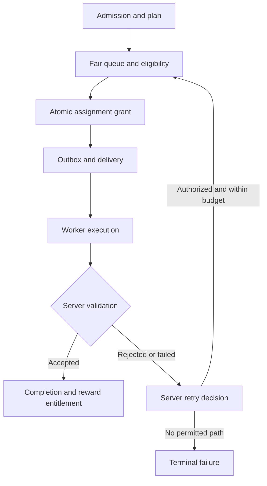
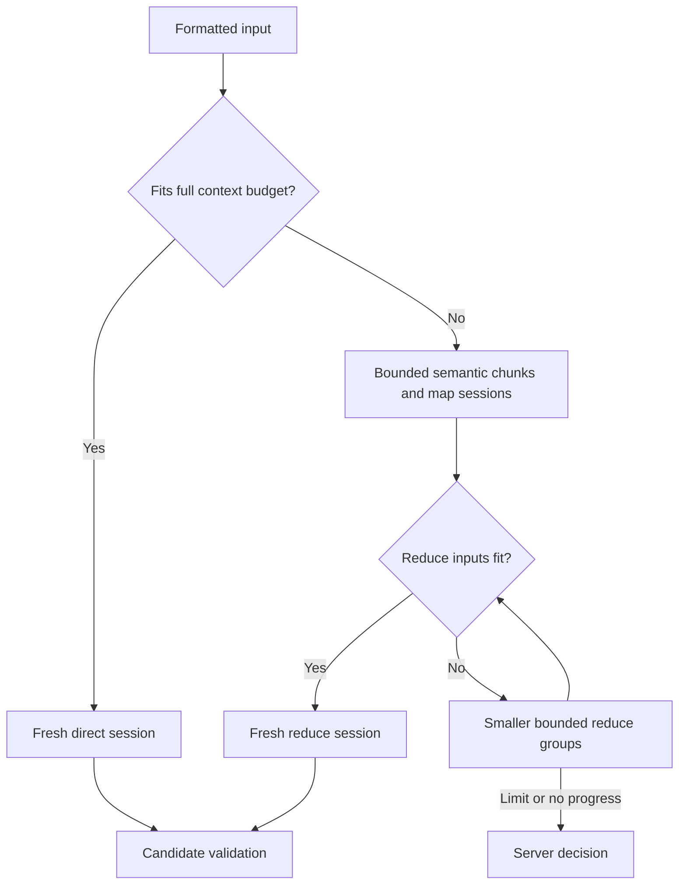

# EdgeMint Target Architecture v2

> **Status:** FROZEN CORE ARCHITECTURE / AUDIT-INTEGRATED SPECIFICATION  
> **Document Type:** Canonical Target Architecture / Implementation Authority  
> **Version:** 2.0  
> **Date:** 2026-09-05  
> **Supersedes:** `EDGE-MINT-TARGET-ARCHITECTURE-v1.md`, version 1.0 dated 2026-09-01  
> **Implementation Status:** UNVERIFIED BY THIS DOCUMENT REVISION  
> **Repository:** [EdgeMint repository](https://github.com/shahinfarahani7/project-pyton-version)

---

## 0. Purpose

This document is the canonical frozen architecture for EdgeMint. It defines the approved target state for the Control Plane, Worker Runtime, resource scheduling, model lifecycle, long-context execution, failure handling, validation, reward, and production proof.

It does **not** claim that every item is already implemented in the current repository. A feature is considered closed only when implementation evidence exists in source code, SQL, contracts, events, tests, and the real production path.

## 0.1 Revision Scope and Authority

This revision incorporates audit findings A01–A24 into the applicable sections. Existing section numbers 0–71 and the presentation-only UI/UX boundary are preserved. Sections 72–77 provide traceability, required configuration, acceptance evidence, current-state claims, investigation guidance, and primary references.

The source v1 SHA-256 is `1f129782f6f8efc1274c14b3654b6cde5aefacfa7af82aa9da0b423ccf60abe5`. The related review is `EdgeMint_Architecture_Audit.md`; its section numbers refer to the earlier 40-section Handoff, whereas this revision's mapping in section 72 refers to this document.

Normative MUST/MUST NOT statements specify the target. Examples and historical observations do not prove implementation. Missing measurements or production policy values MUST block the affected execution path, rather than acquire invented defaults. No repository, SQL, native artifact, or production test has been certified by preparing this revision.

| Information class | Meaning | Change rule |
| --- | --- | --- |
| Frozen core invariant | Authority, consent ownership, execution ownership, resource safety and acceptance boundaries | Explicit architecture revision |
| Versioned policy | Numerical limits, weights, approved rollout and retention configuration | Audited policy revision within the core invariants |
| Reported baseline | Model, package, path, catalog count or bug reported by an earlier handoff | Verify against a named build/snapshot before claiming current truth |
| Hypothesis | A possible cause or explanation | Keep open until evidence supports or refutes it |
| Implementation evidence | Source/SQL/contracts/events/tests for a specific production path | Link to an immutable revision and actual results |

---

# 1. Core Goal

EdgeMint is a distributed AI execution platform where AI tasks run on worker devices such as Android phones, emulators, and future edge nodes.

Supported workload families include:

- text processing,
- OCR,
- document processing,
- lightweight image classification,
- vision,
- VLM,
- segmentation,
- PDF processing,
- structured extraction,
- moderation,
- summarization,
- other task types in the Task Catalog.

The architecture MUST optimize for:

1. Server-controlled scheduling.
2. Safe device resource usage.
3. User-controlled compute contribution.
4. Low device storage usage.
5. Model locality.
6. Multi-task execution where safe.
7. Auditable, bounded, Server-controlled retry and reassignment.
8. Strong lease and fencing semantics.
9. Checkpoint/resume for long tasks.
10. Server-side result validation.
11. Exactly-once accepted completion and reward.
12. Full auditability.
13. Runtime/model replaceability.
14. No worker-side scheduling authority.

---

# 2. Non-Negotiable Decisions

## 2.1 Server Is the Only Scheduling Authority

Only the Server Scheduler may decide:

- which task is scheduled,
- which worker receives the task,
- how many tasks may run concurrently,
- resource budgets,
- retry,
- reassignment,
- cooldown,
- cloud fallback,
- priority,
- assignment expiry,
- reservation release.

The Worker MUST NOT independently decide:

- to fetch arbitrary tasks,
- which task to execute,
- to move a task to another worker,
- to retry a task,
- to reassign a task,
- to choose cloud fallback,
- to increase resource contribution,
- to schedule additional heavy tasks.

## 2.2 Worker Role

The Worker is limited to:

- capability reporting,
- telemetry,
- installed-model reporting,
- assignment receipt,
- assignment validation,
- execution,
- progress,
- checkpointing,
- result submission,
- failure evidence,
- local machine-safety enforcement.

The Worker MUST enforce consent and safety constraints. It MUST defer, pause, or request safe termination when execution permission expires or OOM risk, thermal critical state, OS pressure, consent mismatch, runtime incompatibility, or corrupted runtime/model state makes execution inadmissible. Stop requested is not stop confirmed. The next scheduling action remains a Server decision.

## 2.3 No Local Scheduler

Do not implement:

```text
LocalTaskSelector
LocalRetryOrchestrator
LocalReassignmentManager
LocalCloudFallbackDecision
```

Allowed worker components include:

```text
RuntimeSafetyController
WorkerResourceEnforcer
ExecutionPlanRunner
ModelRuntimeManager
ContextBudgetManager
CheckpointManager
```

## 2.4 Local Plan Execution and Transport Recovery

A Worker MAY execute the stages, bounded branches and chunk/reduce rules contained in its current Server-authorized Plan. It MAY use a mutex/semaphore to enforce a certified runtime limit. These mechanisms grant no authority to choose another Task, Worker, model, execution budget, retry attempt or cloud destination.

The Worker MAY retransmit the same persisted ACK, Progress, Checkpoint or Result message using the same event/idempotency identity under the transport protocol. It MUST NOT rerun inference merely because a response or ACK was lost. Reconnection backoff and bounded transfer recovery are transport behavior, not Task Retry. After expiry, restart or safety stop, further inference/resume requires fresh Server authorization.

Stage-local validation is a preflight check; final acceptance and reward validation remain Server-owned. An execution plan may declare a retryable stage, but any repeated inference must be separately authorized by the Server and counted in the logical TaskRun's budgets.

---

# 3. Repository Structure

Major areas:

```text
src/backend
database/sql
contracts
dsl
docs

src/apps/customer-portal
src/apps/operations-portal
src/apps/worker
```

Expected backend routing/worker areas:

```text
src/backend/edgemint/routing
src/backend/edgemint/workers
src/backend/edgemint/services/router.py
src/backend/edgemint/services/worker_gateway.py
src/backend/edgemint/services/worker_registry.py
```

Worker stack:

```text
Flutter
Dart
Material 3
flutter_gemma
flutter_gemma_mediapipe
PaddleOCR
```

Repository paths and stack entries above are reported/expected locations, not a verified inventory of the current checkout. Before changing code, record the repository commit, production entry points, SQL migration version, dependency lockfiles and resolved package roots. Preserve section 62 when working on UI/UX.

---

# 4. Current Primary On-Device LLM Baseline

```text
Profile ID:       qwen2.5-0.5b
Model Version ID: mdv_qwen2_5_0_5b
Display Name:     Qwen2.5 0.5B
Artifact:         Qwen2.5-0.5B-Instruct_multi-prefill-seq_q8_ekv1280.task
Approx Size:      ~547 MB
```

Current runtime path:

```text
flutter_gemma
    ↓
flutter_gemma_mediapipe
    ↓
MediaPipe LLM
    ↓
CPU
```

Current context/KV profile:

```text
ekv1280
```

Reported baseline retained for compatibility planning:

```text
maxTokens ≈ 1280
```

The prior 4096-token configuration is not the approved baseline. Long inputs MUST be handled before reaching native runtime.

The approximate size is an artifact storage observation, not a RAM reservation. The filename and `ekv1280` suffix alone do not certify the converted graph limit. Before enabling this profile, bind exact artifact bytes/digest, tokenizer/template identity, conversion configuration, configured token limit, native runtime build, ABI, backend and boundary-test evidence in a ModelArtifact/RuntimeCompatibilityProfile.

The upstream Qwen model card reports a 32,768-token model context; this is not proof that this converted `.task` artifact supports that context. [Official Qwen model card](https://huggingface.co/Qwen/Qwen2.5-0.5B-Instruct#introduction)

The actual CPU backend and exact `flutter_gemma`, `flutter_gemma_mediapipe` and native dependency versions MUST be established from the resolved build and runtime evidence. Runtime support policy is specified in section 32; no runtime migration is authorized merely by changing this document.

---

# 5. Model Strategy

## 5.1 One Heavy Model per Device by Default

A normal EdgeMint worker should not store several large LLM/VLM artifacts.

Default:

```text
One primary heavy model
+
OCR runtime
+
optional tiny specialist models
```

Avoid installing Qwen + Gemma + embeddings + Function model + VLM + another LLM on every device.

## 5.2 Move Tasks Toward Models

Principle:

> Move the Task toward the Model, not the Model toward every Task.

Worker telemetry must report:

```text
installedModels
loadedModels
modelVersion
artifactDigest
runtimeCompatibility
```

Model locality is a routing feature.

## 5.3 Fleet Model Pools

Example:

```text
GENERAL TEXT POOL → Qwen2.5 0.5B
LIGHT POOL        → tiny specialist runtimes
OCR POOL          → PaddleOCR
VISION POOL       → VLM / detection / segmentation
```

A worker does not need all model families installed.

---

# 6. Task-Centric Architecture

EdgeMint MUST be task-centric, not model-centric.

Wrong:

```text
Task → Qwen
```

Correct:

```text
Task
  ↓
Task Requirement Resolution
  ↓
Execution Plan
  ↓
Cost Estimation
  ↓
Capability Match
  ↓
Worker Selection
  ↓
Runtime Selection
  ↓
Execution
```

Task contracts declare capabilities such as:

```text
text.summarize
document.extract
document.ocr
image.classify
vision.analyze
```

They MUST NOT hardcode implementation names such as `runQwenTask()`.

---

# 7. Canonical Control Plane Architecture

| Stage | Required responsibility |
| --- | --- |
| Admission | Resolve tenant and processing permission; pin TaskRevision and Input/Output contracts; validate and limit input |
| Planning | Resolve requirements and ExecutionPlan; estimate cost; bind model/runtime-compatible options |
| Queue | Workspace DRR, trusted priority, deadline and starvation protection |
| Eligibility | Fresh heartbeat, trust, consent, data/network/region policy, model and runtime compatibility |
| Feasibility | Resource vector, residency, failure affinity, exclusive groups and runtime-pair compatibility |
| Selection | Worker scoring and deterministic audited tie-break |
| Atomic grant | Task ownership CAS, capacity reservation, immutable Allocation, Assignment, Lease, Fence and Outbox event |
| Delivery | Durable dispatcher, transport, duplicate-safe Inbox, ACK, bounded start and resynchronization |
| Completion | Immutable candidate submission, Server validation, terminal acceptance and reward entitlement |



Outbox is the durable publication mechanism; WebSocket is a transport. Neither an ACK nor a socket connection grants scheduling authority. There is one Control Plane authority even when multiple Server instances race to schedule.

---

# 8. Canonical Worker Runtime Architecture

Assignment handling MUST verify authenticated origin, contract/plan/allocation versions, current execution grant, fence scope, consent version and local runtime safety before inference.

| Component | Responsibility |
| --- | --- |
| Assignment Receiver and Inbox | Durable message identity, ACK, replay handling and bootstrap reconciliation |
| ExecutionPlanRunner | Execute only the bounded Server-authorized plan |
| RuntimeSafetyController / WorkerResourceEnforcer | Enforce resource, time, consent and platform constraints; confirm or report inability to stop |
| ModelRuntimeManager | Verified installation, resident handle ownership, safe activation/eviction and runtime sessions |
| ContextBudgetManager | Count the fully formatted prompt and enforce input/output limits |
| ChunkEngine | Task-specific, deterministic, bounded map/reduce |
| CheckpointManager | Publish complete immutable checkpoints and consume Server-authorized resume grants |
| OCR, LLM, Vision, Tiny/Specialist runtimes | Execute the explicitly selected stage implementation |
| Progress / Result / Failure sender | Durable, bounded, idempotent transport; no inference retry decision |

A local safety semaphore can prevent two incompatible handlers entering Native concurrently. It cannot select waiting Tasks, create capacity or authorize a new stage outside the Plan. Checks also apply during execution, not only at Assignment receipt.

---

# 9. Queue Selection

Approved ordering:

```text
Workspace Deficit Round Robin
→ Priority
→ Deadline
→ Submission Time
→ Task ID
```

Starvation protection baseline:

```text
300 seconds
```

Priority order:

```text
critical
high
standard
batch
```

Priority MUST be server-derived from trusted sources such as entitlement, execution mode, operations override, and SLA policy. Client-provided priority is not authoritative.

## 9.1 Fairness, Admission and Backpressure

Workspace DRR charges a versioned `queueCostUnits` value derived by the Server estimator in common units. Workspace quantum/weight comes from entitlement policy. Dispatch debit and any measured-cost correction must be attributable and idempotent. Retry must not evade tenant concurrency, queue or cost caps.

The 300-second baseline is a starvation-protection trigger, not a completion guarantee or permission to bypass hard eligibility. An eligible aged Task receives the policy-defined promotion/opportunity; an ineligible Task reports its blocker and remains bounded by the overall deadline. Tasks too costly for one quantum may accumulate deficit within a bounded policy so large jobs do not starve.

Configure per-workspace queued/active limits, maximum accepted input cost, queue expiry and backpressure for Outbox, uploads and validation. `NO_ELIGIBLE_WORKER`, capacity saturation and missing contracts are distinct states/reasons. No queue may silently wait forever. Section 73 lists required values; missing policy blocks affected dispatch.

---

# 10. Worker Hard Eligibility

Before scoring, a worker must pass hard filters:

- heartbeat freshness,
- worker availability,
- trust,
- attestation,
- user consent,
- battery policy,
- thermal policy,
- region policy,
- network policy,
- model availability,
- model digest,
- runtime compatibility,
- ABI compatibility,
- Android/runtime compatibility,
- required free storage,
- failure cooldown,
- assignment safety state.

Hard-filter decisions MUST reference the same Worker boot/session, capability snapshot sequence, consent version, model/runtime profile and data-processing policy used by the atomic grant. These claims are rechecked under the capacity/ownership transaction; volatile conditions are checked again locally immediately before execution. A claimed model ID or attestation flag alone does not establish artifact identity or semantic trust. Uncertain physical release state blocks new incompatible work.

---

# 11. Resource Vector Scheduling

Simple assignment count is not sufficient.

Legacy-style logic such as:

```sql
CASE
    WHEN device_tier = 'T4' THEN 2
    ELSE 1
END
```

MUST NOT be the primary capacity model.

Scheduling MUST use a resource vector.

---

# 12. Task Resource Envelope

Each immutable Task Revision must have a server-derived ResourceEnvelope defining admissible input bounds, certified resource minima/maxima, concurrency constraints and versioned allocation/estimation rules. The envelope is distinct from the immutable ExecutionAllocation created for one concrete Input and Plan.

Illustrative numeric allocation fragment, not a measured capacity claim:

```json
{
  "taskType": "text.summarize",
  "runtimeClass": "mediapipe_llm",
  "requiredModelIds": ["qwen2.5-0.5b"],
  "cpuUnits": 40,
  "memoryReservationBytes": 1610612736,
  "storageReservationBytes": 104857600,
  "acceleratorUnits": 0,
  "modelSessionUnits": 1,
  "estimatedDurationMs": 180000,
  "maximumParallelPerDevice": 1,
  "exclusiveGroup": "llm_inference"
}
```

Resource envelopes MUST be server-generated, immutable per revision, versioned, auditable, and not modifiable by client or worker.

## 12.1 Revision Envelope and Per-Execution Allocation

`TaskRevision.resourceEnvelopeId` pins the static constraints/rule versions. For a concrete `taskRunId + inputDigest + executionPlanVersion`, Server derives an `ExecutionAllocation` containing its own ID, TaskRevision ID, policy version, estimator version, calibration/snapshot identity, stage peaks, resident-model commitments, resource units, output/call/time limits and compatibility profile. Assignment references that immutable Allocation.

The example's `cpuUnits: 40` means 40 percent of aggregate logical CPU-time capacity under section 16. If 40 is that Plan's certified minimum, it cannot fit a 30-unit Balanced budget. Server must wait within deadline, select another permitted Plan/profile, or return an explicit infeasibility outcome. Worker cannot lower a certified minimum or raise approved contribution.

`memoryReservationBytes` in an Allocation denotes incremental task/session/stage peak memory; shared model residency and fixed Runtime overhead are separate commitments counted once. `requiredModelIds` expresses profile suitability and must resolve to exact approved artifact digests before execution. `maximumParallelPerDevice` must declare its scope; the illustrated value 1 is a limit for the selected runtime profile, not permission to run another incompatible runtime.

For sequential stages, reserve the relevant peak plus retained shared state. For overlapping stages, reserve simultaneous combined demand. Stage-by-stage acquisition is permitted only as a Server-controlled Plan transition: no unreserved stage may start. Underestimation produces evidence and a new Server decision; Worker cannot mutate the Allocation.

---

# 13. Input-Aware Task Cost Estimation

Task type alone is not enough.

```text
text.summarize with 300 tokens
≠
text.summarize with 30,000 tokens
```

A server-side `TaskCostEstimator` MUST estimate cost using:

```text
taskType
inputBytes
estimatedInputTokens
pageCount
imageDimensions
chunkCountEstimate
runtimeClass
modelVersion
executionPlan
```

Expected output:

```text
predictedDurationMs
predictedPeakMemoryBytes
predictedCpuUnits
predictedEnergyClass
predictedStageCount
predictedInferenceCalls
```

Every prediction MUST record estimator version, input digest, Plan version, selected model/runtime and calibration identity, cold/warm state, uncertainty margin and the limits used to admit execution. Predicted average duration is not a hard timeout, and predicted average RAM is not a sufficient peak-memory cap. Queue, install/load, execution, transfers, validation and escalation contribute separately to total completion time and cost.

Missing/expired calibration takes a bounded conservative policy or blocks the profile. Oversized input is rejected before allocation. Actual measurements update future versioned predictions and do not retroactively enlarge current grants.

---

# 14. Execution Plan

Complex tasks MUST be represented as stage plans.

Example:

```text
document.summarize

Stage 1 → PDF Decode
Stage 2 → OCR
Stage 3 → Text Normalize
Stage 4 → Chunk
Stage 5 → LLM Map
Stage 6 → LLM Reduce
Stage 7 → Validate
Stage 8 → Submit
```

Canonical entity:

```text
TaskExecutionPlan
```

Each stage may have its own runtime class, resource estimate, checkpoint behavior, model requirement, retry semantics, and validation rule.

The Worker executes only the Server-approved plan.

Each Plan pins stage IDs/dependencies, handler/contract versions, allowed model/runtime, branching and chunk rules, stage and aggregate deadlines, output limits, maximum chunks/reduce depth/inference calls, checkpoint compatibility, resource acquisition boundaries and retry class. Failure must produce a Server decision if progressing would exceed these limits.

The Validate stage in a Worker plan is only local pre-validation. Authoritative ResultValidation remains Server-side. A stage retry or runtime/model change creates an explicit Server authorization and consumes the existing TaskRun budget. A mutex or deterministic traversal of an already-approved Plan does not create a local scheduler.

---

# 15. Device Capacity and User Consent

Initial approved modes:

```text
Balanced:    30%
Performance: 50%
```

Changing 30% to 50% MUST NOT change the architecture. It only changes policy budgets.

Profile selection is not consent. A device contributes no resources until its owner explicitly opts in. Balanced 30% is the initial offered profile after opt-in; Performance 50% requires explicit opt-in to that level. Store consent scope, monotonic policy version, owner, effective time and applicable battery/network/storage conditions. The Server cannot increase consent; the Worker cannot increase an Allocation.

---

# 16. Resource Budgets Are Per Resource Class

## 16.1 CPU Units and Enforcement

`100 cpuUnits` represents 100% of the aggregate logical CPU-time capacity of the Worker over the configured measurement window; one unit is one percentage point. `cpuUsageBps = 100 * cpuUnits` on the same time basis. This is a time-share measure, not a claim that all cores have equal computational throughput; calibration accounts for performance differences.

`EffectiveCpuBudget = max(0, min(UserApprovedCpuBudget, ServerPolicyLimit, ThermalBudget, PowerBudget))`.

The runtime profile MUST state measurement window, aggregate process/native coverage, tolerated burst, reaction bound and enforcement method. Thread count alone does not prove percentage enforcement. Distinguish a measured windowed cap from an instantaneous hard cap; a runtime unable to satisfy the advertised policy is ineligible. Hidden/background/transfer work is included in the approved contribution.

## 16.2 Memory Accounting Bases

Memory does not inherit the CPU percentage. Apply two independent checks without double subtraction:

1. **Policy commitment:** fixed Runtime overhead + each unique resident-model commitment + all held incremental task/session peaks + bounded system/transfer commitments must fit the effective application memory limit. That limit is the minimum of user, Server and certified process/native memory limits.
2. **Snapshot headroom:** new incremental peak demand + pending/unloaded commitments not yet reflected in the snapshot + remaining headroom of active allocations must fit `max(0, currentAvailableMemory - memorySafetyReserveBytes)`.

The baseline memory safety reserve is 15% of physical RAM, rounded up to bytes, optionally raised by an explicit absolute safety floor. It is an OS headroom floor, applied once in the snapshot test. The CPU contribution percentage and a second subtraction of this same reserve MUST NOT be applied to memory.

A snapshot must identify which resident and active components its observed memory already includes. For an observed active component, future headroom is the non-negative difference between its reserved peak and the comparable observed usage. Pending components use their full future requirement. Unknown attribution or incomparable metrics means `capacity_uncertain`, not guessed free capacity. Fixed overhead, residency, task peaks and transfer buffers must use the same documented accounting basis without overlapping ownership.

Fresh OS headroom can shrink after admission; the Worker rechecks locally and enforces safety. A Server ledger prevents scheduling races; it does not reserve RAM against unrelated applications.

## 16.3 Storage and Other Resources

Storage independently applies `MaxAIStorage`, `MinimumFreeStorage`, `ModelCacheBudget`, temporary input/output/checkpoint space, download staging and old/new model coexistence. Accelerator units, session slots, memory bandwidth limits and exclusive groups are separate feasibility dimensions. Session slots and exclusive-group tokens cannot be substituted by unused CPU capacity.

30% / 50% are maximum approved CPU contribution profiles under this specification, not guaranteed utilization or a promise that all Tasks fit either profile. Other resource approvals remain separately explicit.

---

# 17. Consent Changes During Execution

| Change | Required Worker behavior | Required Server behavior |
| --- | --- | --- |
| Increase 30% to 50% | Report new owner-approved version; retain current grant until Server changes it | Apply increased capacity to new/replacement allocations; do not restart a safe current stage merely for the increase |
| Decrease 50% to 30% | Enforce the reduced limit within the certified reaction bound; stop new inadmissible stages; request pause/cancel if the active stage cannot comply | Invalidate incompatible future stage grants; authorize compliant continuation or checkpoint-based reassignment |
| Full device contribution revocation | Stop accepting work and request safe termination immediately; report scope/version and actual stop state | Revoke affected device grants, advance ownership where necessary, and retain uncertain physical holds until reconciled |
| Data-owner processing revocation / Task cancellation | Stop affected processing and uploads according to the data policy | Atomically cancel the logical TaskRun; no fallback/retry may bypass the revocation |

Finishing the current atomic stage is permitted only if it remains inside the new permission and the certified safety/stop bound. The label atomic does not allow an arbitrarily long inference to continue above a reduced limit. Checkpointing is best effort and must not postpone revocation or send data after permission to upload has ended.

If Native cannot interrupt promptly, request the certified termination mechanism, mark `stop_requested/capacity_uncertain`, and do not declare resources released. A profile without a demonstrable stop/reaction bound is not eligible for a policy promising that bound.

Assignments carry consent version/scope; version mismatch requires revalidation. Local revocation is acted upon immediately when known; remote propagation is bounded by the execution-grant lifetime and protocol. When revoked consent also removes memory residency permission, release the resident Native model and fixed compute state through the certified cleanup path; retained model files follow the separately approved storage policy. Do not keep consuming revoked RAM merely because inference stopped. Re-enabling contribution does not automatically resume an expired or terminal Assignment. Device consent and data-owner permission are distinct authorities.

---

# 18. Worker Resource Enforcer

The worker-side safety component is:

```text
WorkerResourceEnforcer
```

or equivalently:

```text
RuntimeSafetyController
```

It MUST NOT be a scheduler.

Allowed decisions:

```text
EXECUTE
DEFER_FOR_SAFETY
PAUSE_FOR_SAFETY
ABORT_FOR_SAFETY
```

It may enforce user consent, thermal limit, memory safety, OS pressure, battery policy, and runtime safety.

A local enforcement decision must report reason, consent/policy version, lease identity, runtime operation and `stopRequestedAt/stopConfirmedAt` where available. Safety suppression is mandatory when a limit is breached. Capacity remains physically held until the relevant stop/cleanup is confirmed or reconciled under section 47. Local safety enforcement never grants permission to resume after an expired grant.

---

# 19. Resource Reservation Ledger

Canonical table: `worker_resource_reservations`.

Required fields include reservation ID, `task_run_id`, `attempt_id`, `assignment_id`, `task_revision_id`, `execution_allocation_id`, Worker device and boot/session identity, policy/consent versions, capacity snapshot sequence, CPU/memory/storage/accelerator/session quantities, exclusive group/compatibility profile, fence token, creation/activation/expiry timestamps, logical status, physical release state and release proof/reason.

Logical reservation statuses remain `reserved`, `active`, `released`, `expired`, `revoked`. Physical release is tracked independently as `held`, `stop_requested`, `unknown`, `released`. Expired/revoked reservations with unreconciled physical use continue to consume physical capacity in admission calculations. Only a proven-unused or confirmed/reconciled release becomes reusable.

Model residency and fixed Runtime overhead have separate Worker-scoped commitments. Releasing a Task reservation does not release its still-resident model's memory. Shared model memory is counted once per actual runtime/model resident identity.

Remaining policy capacity is effective approved capacity minus all held commitments on that resource's accounting basis. The OS headroom test and its single safety reserve are separately defined in section 16. Do not subtract full active reservations again from telemetry that already reflects their current consumption.

All release operations are idempotent and authorized by Server state transitions. A sweeper reclaims unstarted/abandoned logical work within configured bounds, but cannot infer physical termination from TTL alone. Reconciler state, stop evidence and current boot/runtime identity determine whether a physical hold can be released.

---

# 20. Atomic Assignment Transaction

Required sequence:

1. Lock Task Attempt.
2. Lock Worker Capacity.
3. Re-check heartbeat freshness.
4. Re-check consent.
5. Re-check worker availability.
6. Re-check model/runtime compatibility.
7. Recalculate remaining capacity.
8. Re-check exclusive groups.
9. Create Resource Reservation.
10. Create Assignment.
11. Generate Fence Token.
12. Persist lease-token security material as required.
13. Create Outbox Event.
14. Commit.

If any step fails:

```text
No partial Assignment
No leaked Reservation
```

Approved policy:

```yaml
reservationMode: compare_and_swap
overbookingAllowed: false
assignmentMode: server_auto_lease
perTaskWorkerConfirmation: false
```

The transaction also pins `taskRunId` ownership generation, input/Plan/Allocation identities, tenant/data policy, consent version and Worker boot/session. Fence advancement is atomic across all assignments and attempts of the same logical run. Locks/CAS and uniqueness constraints must be database-visible across all scheduler instances, with a documented consistent lock order. Compatibility and held physical capacity are checked in the same authoritative transaction.

Outbox rows carry event ID, aggregate/version sequence, routing/trace IDs and bounded delivery/start validity. No external network send occurs inside the capacity transaction. Commit and subsequent Dispatcher failure must be recoverable. Storage uploads and external payouts are not magically included in this SQL transaction.

---

# 21. Delivery ACK vs Scheduling Decision

`perTaskWorkerConfirmation: false` remains correct. No user confirmation or Worker task-selection decision is added per Task.

| Protocol event | Meaning |
| --- | --- |
| Assignment committed | Server grants the named work under a bounded Lease and Allocation |
| Assignment Received ACK | Worker durably recorded the event; ACK grants no scheduling authority |
| Started evidence | Worker passed local current-grant/consent/safety checks and actually began authorized execution |
| Safety rejection/stop | Worker reports why it cannot safely exercise the grant; Server selects the next action |

Dispatcher retries delivery with the same event identity. Inbox processing is idempotent and version-aware. Configure delivery ACK deadline and start deadline; lack of ACK is not proof that execution never began. A delayed Assignment cannot restart its validity clock on arrival.

On reconnect/restart, Worker reconciles locally persisted Assignment IDs, boot identity, fences, active Native operations and pending outgoing messages with Server before starting/resuming work. Server may re-deliver, revoke, acknowledge an already recorded result, or issue fresh authorization. Older events cannot reverse a cancellation/new generation. Outbox, Inbox and outgoing-message retention must cover the replay/late-arrival horizon.

---

# 22. Lease and Fence

Every state-changing Progress, Checkpoint, Lease Renewal, Failure, Result or Completion operation is bound to authenticated Worker identity and `taskRunId + attemptId + assignmentId + fenceToken + workerBootId`. Fence tokens increase monotonically over all ownership changes of one TaskRun, including a new Attempt; an old Assignment ID with an internally consistent token is not enough.

Server checks current owner/generation, legal entity state, grant validity, policy/consent and message identity. Worker checks the authenticated grant and its conservative local expiry; an offline Worker cannot infer global current ownership merely from a token seen earlier.

Server time governs validity. The protocol must specify Lease TTL, renewal interval, delivery/start limits, latency/clock-uncertainty allowance and suspension-aware local timing. Local expiry is conservatively derived from a current authenticated Server grant; a delayed/replayed grant cannot extend execution. After suspension or timing uncertainty, obtain a fresh grant before further inference. Renewal is conditional on current ownership and cannot revive an expired/revoked grant.

At local expiry/revocation, Worker requests bounded termination and reports actual state. Fencing prevents stale effects, not physical duplicate computation. Section 47 controls physical release and reassignments.

A fully uploaded result submitted while the execution grant is valid can become an immutable candidate. Server atomically pins its ownership generation and validation job. Compute capacity may then be released on stop/cleanup evidence. Validation uses its own Server-side work lease; the compute lease need not run for the whole validation duration. Completion still requires that the pinned generation/candidate remains current and the TaskRun has not been cancelled or reassigned. Compute-lease expiry after a valid candidate was pinned does not by itself invalidate that candidate or enqueue another inference attempt. Server must explicitly abandon/invalidate the candidate before changing ownership; cancellation and overall deadline still apply. This does not permit accepting a first result submission after its execution grant expired.

A duplicate request for a previously accepted identical result may return its stored receipt without a new state change. Stale evidence may be retained separately as diagnostic data, with no effect on ownership, Progress, Completion or Reward.

---

# 23. Execution Identities and State Machines

## 23.1 Entity Identity

| Entity | Identity and role |
| --- | --- |
| TaskDefinition / TaskRevision | Versioned reusable capability and immutable contracts; not one customer execution |
| TaskRun | One logical customer request; immutable input digest, tenant, deadline and aggregate budgets |
| TaskAttempt | Server-authorized retry strategy/plan attempt within one TaskRun |
| Assignment | One grant to one Worker under one Attempt; reassignment creates a new Assignment and generation |
| ExecutionAllocation | Immutable resource/limit decision for concrete input, Plan and compatibility context |
| Lease | Time-limited authority for the Assignment; distinct from physical process lifetime |
| ResourceReservation | Logical resource commitment plus separately reconciled physical release state |
| ResultCandidate / ResultValidation | Immutable uploaded candidate and its versioned Server quality decision |
| RewardEntitlement / RewardLedger | Idempotent business entitlement and accounting records tied to an accepted outcome |

Repeated executions of the same TaskRevision have different TaskRun IDs. Client submission idempotency is scoped to tenant and client request key plus payload digest; the same key with a different payload conflicts. Keys remain protected for the configured late-arrival horizon.

## 23.2 State Ownership

| Entity | Nonterminal states | Terminal states |
| --- | --- | --- |
| TaskRun | PENDING, ROUTING, QUEUED, EXECUTING, VALIDATING | SUCCEEDED, PARTIAL_SUCCEEDED, FAILED, CANCELLED, DEADLINE_EXPIRED |
| TaskAttempt | CREATED, ROUTING, ACTIVE, WAITING_SERVER_DECISION, VALIDATING | SUCCEEDED, EXHAUSTED, FAILED, CANCELLED |
| Assignment | RESERVED, ASSIGNED, DELIVERED, STARTED, RUNNING, RESULT_SUBMITTED, VALIDATING | SUCCEEDED, REJECTED, EXPIRED, REVOKED, SAFETY_STOPPED, FAILED |
| ResultValidation | PENDING, RUNNING | PASSED, FAILED, ERROR |
| RewardEntitlement | PENDING | RECORDED, INELIGIBLE |

`STALE` is a rejection/audit classification for an obsolete write, not a state that revives or replaces a terminal Assignment. Physical release state remains independent of these terminal business states. Successful partial completion requires an explicit Task contract and accepted scope; a partial payment alone does not imply Task completion.

## 23.3 Canonical Transition Rules

| Operation | Preconditions | Atomic effects |
| --- | --- | --- |
| Admit | Valid permission, pinned Revision/input and feasible admission limits | Create/deduplicate TaskRun; enter QUEUED |
| Assign | Run/Attempt routable; current generation; eligible Worker and capacity | Create immutable grant/reservation/Outbox; mark Attempt ACTIVE and Run EXECUTING |
| ACK / Start | Current valid grant, matching boot/consent; legal predecessor | Advance Assignment without regression; duplicate same event has no extra effect |
| Submit result | Live RUNNING grant, complete authorized artifact, matching hash/schema identity | Pin one candidate and generation; Assignment RESULT_SUBMITTED; Run/Attempt VALIDATING |
| Begin validation | Current pinned candidate, no terminal Run | Assignment VALIDATING; create/claim bounded validation job |
| Accept | Validator PASSED for exact current candidate, live data policy, deadline, no terminal Run | CAS final Run outcome; mark winning Attempt/Assignment; record reward entitlement or its durable Outbox |
| Reject candidate | Failed quality/contract for current candidate | Assignment REJECTED; Attempt WAITING_SERVER_DECISION; no reward entitlement |
| Retry / reassign | Run nonterminal, permission/deadline/budgets allow; old authority retired | Increment generation, invalidate abandoned candidate; create fresh Assignment or Attempt; route without reviving old grant |
| Expire / safety stop | Execution grant expired before a candidate was pinned, or execution became certified unsafe | End grant; retain unresolved physical hold; Attempt WAITING_SERVER_DECISION; an already pinned candidate follows section 22 |
| Cancel | Nonterminal Run and authorized cancellation | CAS Run CANCELLED; cancel Attempts, revoke grants/candidates; request stop and policy-allowed cleanup |
| Exhaust / deadline | No permitted strategy/budget/time remains | Mark affected Attempt EXHAUSTED/FAILED and Run terminal as applicable |

Only Server changes authoritative business states. Worker events are evidence evaluated by Server. Terminal TaskRun states are immutable; a new requested execution needs a new TaskRun. Cancellation and acceptance race on the same persisted Run version: the first valid terminal commit wins, and later operations return the recorded outcome. Late Worker timestamps cannot override that order.

TaskAttempt may route up to the assignment budget in section 44; Assignment is never moved to another Worker. Validation ERROR can be retried as a bounded Server validation job without rerunning inference or creating a new accepted result. All transitions require reason, actor, prior/new version and correlated IDs in the audit trail.

---

# 24. Model and Session Lifecycle

This is a critical frozen decision.

## Model Lifetime

```text
Load model once per healthy process/runtime generation while residency is permitted
Reuse model across tasks
Unload only on:
- memory pressure,
- explicit lifecycle shutdown,
- consent revocation or a policy change withdrawing residency permission,
- model replacement,
- corruption,
- long idle policy.
```

## Session Lifetime

```text
One inference stage
→ one session
→ close session
```

Canonical rule:

> Model lifetime != Session lifetime.

Model registration, verified artifact file, active model identity, Native model handle and per-inference Session are distinct states. A resident handle is reusable only within the current healthy Process/Runtime and compatible configuration. Process death/reboot invalidates handles even if the verified model file remains installed. Reload after a fresh authorized startup is expected, not a breach of the residency rule.

Model acquisition/installation/activation MUST be single-flight or equivalently serialized per runtime/model generation. Verify must not race activation into clearing a valid identity. Track active session references; do not unload, replace or evict an in-use model. Drain or safely terminate affected work first. Idle eviction is a versioned policy and reports updated residency to Server.

Close each Session in success, cancellation and failure paths where Process execution is still available. Session closure must release per-task context/KV/buffers without erasing the reusable model handle. No Task may inherit another Task's conversation context or output buffers.

Android controls Process lifetime, and cleanup callbacks are not a guaranteed crash recovery mechanism. The platform profile must define foreground/background service behavior, suspension, reboot and restart reconciliation. [Android Process lifecycle](https://developer.android.com/guide/components/activities/process-lifecycle) Foreground-service background starts are subject to platform restrictions. [Android service restrictions](https://developer.android.com/develop/background-work/services/fgs/restrictions-bg-start)

Production residency proof requires Native create/close counters, Session counters, memory measurements and a period of idle operation plus representative tasks. Three short successful tasks are a smoke test, not full lifecycle certification. Investigation requirements are in section 76.

---

# 25. Long-Context Processing

Native runtime MUST NOT be the first overflow detector.

```text
Prompt Builder
      ↓
Token Estimator / Tokenizer
      ↓
ContextBudgetManager
      ↓
Direct Inference OR Chunk Pipeline
```

For the current Qwen baseline:

```text
Total context budget ≈ 1280 tokens
```

Initial conservative budget:

```text
System / Template      ~ 200
Input                   ~ 600
Output Reserve          ~ 300
Safety Margin           ~ 180
--------------------------------
Total                  ~ 1280
```

Exact values must be calibrated with runtime measurements.

## 25.1 Enforced Token Contract

For this API, `maxTokens` includes input and output. [MediaPipe configuration options](https://developers.google.com/edge/mediapipe/solutions/genai/llm_inference/android#configuration_options)

`effectiveContextLimit = min(verifiedArtifactContextLimit, configuredRuntimeContextLimit, taskPolicyContextLimit)`; all three limits must be verified/configured before dispatch. The reported 1280 value remains a provisional compatibility baseline until artifact-bound tests confirm it.

Before every Map, Reduce or direct inference:

1. Build the exact final prompt, including system instructions, template, special tokens, separators, source markers and any injected metadata.
2. Count with the pinned compatible tokenizer. If exact counting is unavailable, use a validated conservative upper bound for every supported input/language class; unknown bounds block inference.
3. Require `formattedPromptTokens + maxOutputTokens + safetyTokens <= effectiveContextLimit`.
4. Enforce `maxOutputTokens` using the certified Runtime stop/limit mechanism. A reserved number is not a generation stop mechanism.
5. Record termination reason and whether output is complete/truncated. A truncated JSON object or summary is not silently treated as successful.

The ~200/~600/~300/~180 split is illustrative, not fixed permission to send any 600-token text. Template changes consume the same budget. Tests cover Persian, English, mixed text, JSON, long system prompts and boundary special tokens. Unsupported oversized Tasks follow a permitted alternative Plan or return an explicit unsupported/infeasible outcome.

---

# 26. Hierarchical Summarization

Each Map and Reduce inference uses a fresh short-lived Session against a reusable resident model. The Plan determines chunk order and allowed concurrency; a map diagram does not grant parallel Qwen execution.



With the illustrative budget, three 300-token summaries require `900 + 200 + 300 + 180 = 1580` tokens. They cannot be blindly combined in a 1280-token session. Two such summaries use the nominal 600 input tokens before extra separators/metadata; actual fan-in must be calculated from the complete formatted prompt, not fixed at two or three.

Recursive reduce is permitted only inside a Server-authorized bounded Plan with `maxChunks`, `maxReduceDepth`, `maxInferenceCalls`, `maxOutputTokensPerStage`, total time/cost limits and a measurable progress rule. A reduce level must reduce the intermediate token mass or number of unresolved groups according to that rule. No-progress or depth/call exhaustion stops the Plan and reports evidence for Server action.

A final summary is submitted only when every required map range and reduction dependency is accounted for and the output meets the Task contract. Hierarchical summarization is an execution strategy, not proof that all details or distant dependencies were preserved.

---

# 27. Chunking Rules

Chunking MUST:

- preserve sentence boundaries,
- prefer paragraph boundaries,
- avoid cutting words,
- support controlled overlap,
- deduplicate overlap content,
- respect token budget,
- support deterministic chunk IDs,
- support checkpoint/resume.

Naive fixed-character slicing is not the production strategy.

Chunking policy is Task-specific and versioned. The TaskRevision declares whether chunking is allowed, splitting/overlap/merge rules, required ordering, source-offset representation and maximum limits. Non-chunk-safe tasks do not receive generic splitting in the common Qwen processor.

Pin chunker version and tokenizer/template versions; derive chunk IDs from immutable input identity, Plan/stage identity and defined boundaries. Preserve stable source offsets for evidence and merge. Translation, structured extraction, OCR tables, summarization and embedding need different merge semantics. Preserve required numbers, negations, exceptions and cross-section relationships through explicit validation requirements; do not promise lossless summarization.

Boundaries/overlap count against token and inference budgets. Local branch execution must remain within the Plan limits in section 14.

---

# 28. Chunk Checkpoints

Required checkpoint manifest fields:

```text
authoritativeCheckpointId
checkpointSchemaVersion
taskRunId
taskRevisionId
inputDigest
executionPlanId / executionPlanVersion
stageId / chunkId / chunkIndex
chunkerVersion / tokenizerVersion / promptTemplateVersion
modelVersionId / artifactDigest
runtimeVersion / backend
producerAttemptId / producerAssignmentId / producerFenceToken
producerWorkerBootId
processedRanges / completedChunkIds
resultArtifactReferences / hashes
validationVersion / validationStatus
createdAt / retentionPolicyVersion
```

For a contiguous-only Plan, `processedRange` may encode a proven gap-free prefix. Parallel or noncontiguous work requires an explicit completion set/map, with deterministic ordering and no inferred coverage across gaps.

Upload checkpoint data completely, verify ownership/integrity and publish the immutable manifest atomically as readable metadata. Incomplete/unaccepted checkpoints are not resume sources. The producing fence is provenance only; new writes require the current Assignment's grant. Full cross-Worker compatibility/rebinding is specified in section 46.

---

# 29. Concurrency Model

Initial production-safe concurrency:

```text
LLM Heavy = 1
VLM Heavy = 1
```

Default:

```text
Qwen + Qwen           ❌
Qwen + VLM            ❌
VLM + VLM             ❌
```

OCR baseline:

```text
Default OCR concurrency = 1
```

Higher OCR concurrency is allowed only for certified device/runtime profiles.

```yaml
paddle_ocr:
  defaultMaximumSessionsPerDevice: 1
  certifiedMaximumSessionsPerDevice: 2
```

## 29.1 Conflict Scope

The separate per-runtime caps do not allow one LLM and one VLM together. Initial heavy runtimes share an exclusive heavy-compute token of capacity 1. Model Session units are also constrained in their certified runtime/model scope. Resource feasibility alone never overrides this conflict.

| Runtime pair | Default | Exception rule |
| --- | --- | --- |
| Qwen + Qwen | Prohibited | No v2 baseline exception |
| Qwen + heavy VLM | Prohibited | Explicit future architecture/profile authorization required |
| Heavy VLM + heavy VLM | Prohibited | No v2 baseline exception |
| Qwen + PaddleOCR | Sequential | Exact pair/device/runtime/model/policy profile certification |
| PaddleOCR + PaddleOCR | One session | Certified profile may allow 2 within all resource limits |
| Heavy compute + light/system transfer | Conditional | Bounded resource demand and reserved control-plane responsiveness |

Compatibility is symmetric and checked both at the Server atomic grant and by a Worker safety guard. A group name such as `llm_inference` must map to the shared heavy conflict and runtime-specific limits; different names alone cannot authorize incompatible overlap. Nested stage concurrency consumes the Parent's reserved capacity or a new Server grant.

---

# 30. Qwen + OCR Concurrency

Do not globally enable Qwen + OCR parallel execution in the retained v2 baseline.

Default:

```text
Qwen running
→ OCR waits
```

Enable concurrent execution only when the calibration/compatibility profile certifies:

```text
mediapipe_llm + paddle_ocr = safe
```

Certification must consider CPU, RAM, memory bandwidth, thermal, battery, latency, crash rate, and 30%/50% policy compliance.

---

# 31. Light Work During Heavy Inference

Light/system work may run concurrently with heavy inference.

Examples:

```text
Result Upload
Telemetry
Checkpoint upload
JSON parsing
Hashing
Network I/O
```

Recommended execution classes:

```text
HEAVY_COMPUTE
MEDIUM_COMPUTE
LIGHT_CPU
NETWORK_IO
SYSTEM
```

Classification is demand-based. Large JSON parsing, hashing, compression/encryption or Upload buffering can be CPU/RAM intensive. Each path needs maximum input/buffer/in-flight bytes, time limits and Backpressure; it must be upgraded to an appropriate compute class when necessary.

Reserve bounded capacity/priority for heartbeat, Lease renewal, cancellation and health reporting so result transfer cannot starve control messages. This reservation still counts within the device owner's approved resources. Upload and checkpoint work does not become unmetered merely because inference stopped.

---

# 32. Runtime Compatibility Profiles

Compatibility may depend on:

```text
Runtime A
Runtime B
Model A
Model B
ABI
Android version
Page size
Accelerator
Plugin version
Artifact type
Certified concurrency
```

Canonical entity:

```text
RuntimeCompatibilityProfile
```

This is required because native compatibility may differ across Android versions, x86_64/arm64, 4KB/16KB pages, plugin versions, artifact types, and delegates.

A profile pins exact model artifact, tokenizer/template, Native and Flutter package builds, backend, ABI, OS/API/page-size context, cancellation mechanism, context limits, memory accounting and concurrency/consent enforcement certification. Unknown or expired profiles cannot pass production hard eligibility.

Calibration must distinguish physical devices from emulators. MediaPipe's Android guide does not promise reliable emulator support; emulator success alone is not physical-device certification. [Official MediaPipe quickstart](https://developers.google.com/edge/mediapipe/solutions/genai/llm_inference/android#quickstart)

## 32.1 Runtime Support and Upgrade Policy

As checked on 2026-09-05, the official guide identifies MediaPipe LLM Inference as maintenance-only and recommends LiteRT-LM as a migration path. [Google AI Edge guidance](https://developers.google.com/edge/mediapipe/solutions/genai/llm_inference/android)

This is a dependency lifecycle fact, not evidence that the current EdgeMint build is defective. Keep the current Qwen/MediaPipe baseline pinned until a separate versioned runtime evaluation passes artifact conversion/compatibility, lifecycle, context, memory, quality, cancellation and rollback tests. Runtime/model replaceability is a core goal; no silent dependency upgrade or global model replacement is allowed. Record the runtime policy owner and review evidence without assuming a migration has been implemented.

---

# 33. Device Calibration

Do not rely only on RAM or static tiers.

Workers SHOULD run a controlled benchmark measuring:

```text
LLM warmup time
LLM prefill tokens/sec
LLM decode tokens/sec
Peak LLM memory
OCR page latency
OCR throughput
CPU average
Thermal delta
Runtime stability
```

Canonical entity:

```text
WorkerCalibrationProfile
```

Calibration itself requires a Server-authorized bounded benchmark Plan and active device-owner consent. It cannot run as an unapproved local background scheduler.

Record device/boot/OS/ABI/backend, artifact and Runtime builds, policy level, initial thermal/battery/network state, cold versus warm load, input sizes, sample count, measurement intervals, per-stage peaks, uncertainty and expiry. Separate model load, prefill, decode, OCR preprocess/inference and transfer costs. Device tiers are fallback metadata, not a replacement for a certified profile.

Changing model/runtime/OS or invalidating thermal/stability assumptions expires or requalifies the relevant profile. Conservative fallback profiles must themselves be defined and bounded. Reported Telemetry is evidence under the declared Worker trust model, not cryptographic proof of honest compute.

---

# 34. Cost Prediction Feedback

Illustrative factorization; each dimension requires its own calibrated function and units, not one universal multiplier:

```text
BaseTaskCost
× InputSizeFactor
× DeviceCalibrationFactor
× RuntimeFactor
```

Store:

```text
Predicted:
- CPU
- memory
- duration
- energy class

Observed:
- CPU
- peak memory
- duration
- thermal delta
- tokens/sec or pages/sec
```

Prediction error should improve future calibration.

Each prediction/observation pair includes TaskRun, Allocation, Plan, estimator and calibration versions. Compare the same phase and memory/CPU/time basis; never compare a warm decode average to cold end-to-end latency. Track percentile/error margins and underestimation rates by profile.

Predictions guide admission; hard limits constrain execution. Updates affect future allocations only. Underestimation cannot authorize current overuse. Calibration/estimator changes are auditable and roll back to an explicitly compatible profile if they regress safety or quality.

---

# 35. Adaptive Concurrency

Concurrency SHOULD eventually be device-certified.

Example:

```text
Device A
Heavy=1
Medium alongside Heavy=0

Device B
Heavy=1
Medium alongside Heavy=1

Device C
Heavy=1
Medium=2
```

Do not hardcode one concurrency profile for all devices.

Certification applies to a specific workload pair, model/runtime builds, device/OS and consent policy. It does not change the baseline heavy-compute token or permit more Qwen sessions merely because RAM appears free. Expired certification restores the conservative compatible profile for new grants and safely reconciles current execution.

---

# 36. Worker Scoring

Hard eligibility and feasibility happen before scoring.

Recommended dimensions:

| Feature | Suggested Weight |
|---|---:|
| Model Locality | 20% |
| Trust | 18% |
| Predicted Completion Time | 16% |
| Resource Fit | 14% |
| Regional Compliance | 10% |
| Price Efficiency | 8% |
| Network | 5% |
| Reliability | 5% |
| Battery / Charging | 2% |
| Fragmentation / Scarcity Cost | 2% |

Exact weights remain policy-controlled.

All feature scales, missing-value rules, score version and exact policy weights are recorded. Hard trust/region/consent/resource requirements cannot be offset by a better weighted score. Calibration or model-locality scoring cannot bypass DRR fairness and aging policy.

---

# 37. Resource Fit and Scarcity Cost

Resource Fit measures whether the worker remains healthy after assignment.

Possible dimensions:

```text
remainingMemoryHeadroom
remainingCpuHeadroom
remainingModelSessionCapacity
remainingAcceleratorCapacity
thermalHeadroom
```

Scarcity/fragmentation cost prevents cheap tasks from consuming scarce high-capability workers unnecessarily.

---

# 38. Deterministic Tie-Breaking

The tie-break remains keyed HMAC-SHA256, with an unambiguous input contract:

```text
HMAC-SHA256(routerTieBreakKey, canonicalEncode(taskRunId, workerDeviceId, routerEpoch))
```

Use the configured deterministic digest ordering among equal-scoring eligible workers. Canonical field encoding and key version are fixed by routing policy; an exact digest tie falls back to stable Worker ID ordering. The router epoch is recorded so replay reproduces the same decision. Audit key version and input identities, never the secret key itself. A public Task ID is not the HMAC secret.

RoutingDecisionAudit records the candidate set, hard-filter reasons, capacity/consent/snapshot versions, scores, chosen Worker and ownership transaction outcome.

---

# 39. Heartbeat and Telemetry

Heartbeat should include at least:

```json
{
  "sequence": 1842,
  "observedAt": "2026-09-01T10:00:00Z",
  "cpuUsageBps": 2100,
  "availableMemoryBytes": 3221225472,
  "availableStorageBytes": 21474836480,
  "thermalState": "nominal",
  "batteryBps": 7800,
  "charging": true,
  "networkType": "wifi",
  "activeAssignmentIds": ["asg-1"],
  "installedModelIds": ["qwen2.5-0.5b"],
  "loadedModelIds": ["qwen2.5-0.5b"],
  "runtimeSessions": {
    "mediapipe_llm": 1,
    "paddle_ocr": 0
  }
}
```

The example is illustrative. Production Telemetry additionally includes `workerBootId`, authenticated connection/session identity, consent/policy version, Server receipt time, model artifact/Native handle generation, per-component memory attribution, held/reserved Allocation IDs, stop requested/confirmed state, transfer buffers, current context/runtime limits and calibration identity.

Sequence is monotonic within a boot/session; a new boot changes that namespace. Server uses trusted receipt time plus protocol-defined freshness, not the Worker wall clock alone. Duplicate/out-of-order samples cannot regress capacity or consent state. Heartbeat alive does not prove inference progressing; Progress is stage-specific. No heartbeat renewal grants a Task lease unless the Assignment renewal contract explicitly succeeds.

---

# 40. Reservation vs Telemetry Reconciliation

A reservation is a peak commitment, not expected instantaneous consumption. `Observed - Reserved` is therefore not a meaningful generic error metric. Compare observations to the corresponding predicted stage/load phase and separately enforce hard reserved peaks.

| Accounting component | Reconciliation rule |
| --- | --- |
| Fixed Runtime and resident models | Maintain unique Worker/runtime/model commitments even after Task completion |
| Active Task/session memory | Compare attributed observed usage and reserved peak on the same metric basis |
| Reserved but not yet loaded/executed demand | Deduct future headroom not reflected in the snapshot |
| Expired/revoked Assignment with unknown termination | Retain physical hold; prevent incompatible admission |
| Transfer/system buffers | Account separately with explicit bounds; avoid overlap with task accounting |
| Missing/stale/incomparable snapshot | Mark capacity uncertain and request fresh reconciled evidence |

Persistent unexplained excess, stale state or missing attribution causes no new heavy assignments, `capacity_uncertain`, a fresh snapshot request and Server-directed recalibration/quarantine if appropriate. Reconciliation is keyed by Worker boot/session, snapshot sequence, Allocation and runtime generation. Normal underuse of a peak reservation is not itself misconduct or evidence of unused guaranteed capacity.

On Server restart, reconcile durable ownership/reservations, Outbox and in-flight validation before admitting conflicting grants. On Worker restart, reconcile which Native processes/handles survived under the certified runtime isolation model. Follow sections 16 and 47 for actual release.

---

# 41. Failure Handling

Worker never decides retry. Worker submits failure evidence.

## Before Execution

```text
MODEL_UNAVAILABLE
INSUFFICIENT_MEMORY
INSUFFICIENT_STORAGE
RUNTIME_INCOMPATIBLE
THERMAL_BLOCK
NETWORK_POLICY_MISMATCH
DELIVERY_TIMEOUT
START_TIMEOUT
CONSENT_MISMATCH
```

## During Execution

```text
RUNTIME_OUT_OF_MEMORY
RUNTIME_CRASH
INFERENCE_TIMEOUT
MODEL_EXECUTION_FAILED
OS_PROCESS_TERMINATED
INPUT_RUNTIME_UNSUPPORTED
CONTEXT_BUDGET_EXCEEDED
```

## After Execution

```text
RESULT_INVALID_JSON
RESULT_SCHEMA_MISMATCH
RESULT_EMPTY
RESULT_LOW_CONFIDENCE
RESULT_SIGNATURE_INVALID
GOLDEN_VALIDATION_FAILED
```

Frozen rule:

> Execution Success != Task Success.

Failure classification includes `scope`, retryability, root evidence, policy version and whether compute has actually stopped. Scope distinguishes Input/Task, Worker, model/artifact, runtime build, network/Provider and permission owner. Unknown codes or ambiguous scope fail closed for automated retry and enter a bounded Server decision path.

A native crash or OS kill may prevent Worker failure reporting. Server infers loss of grant from Lease/connection evidence and later reconciles authenticated restart/crash metadata; it must not depend on a Dart exception handler running after SIGSEGV. `RESULT_INVALID_JSON` is local pre-validation evidence; Server owns authoritative schema/quality acceptance.

---

# 42. Failure Evidence

Example:

```json
{
  "assignmentId": "asg-123",
  "attemptId": "att-123",
  "fenceToken": 4,
  "healthSnapshotSequence": 1872,
  "observedAt": "2026-09-01T10:15:00Z",
  "failureCode": "RUNTIME_OUT_OF_MEMORY",
  "metrics": {
    "peakMemoryBytes": 1835008000,
    "executionTimeMs": 64000
  },
  "checkpointId": "chk-45"
}
```

Production FailureEvidence also carries `taskRunId`, Worker boot/session, Plan/Allocation/policy/consent versions, model artifact and runtime build, failure scope, stage/call index, stop state and causality/trace identity. `CONSENT_REVOKED` must identify device contribution versus data-processing scope; the new scoped codes are canonical and any existing alias requires explicit contract-version mapping.

Runtime metrics have explicit units and observation intervals. Redact raw prompt/output and credentials. Stale failure evidence may be stored in an append-only diagnostic record but cannot mutate current ownership, apply automatic penalties or trigger a stale Task retry.

---

# 43. Retry Classification

Retry mapping is Server-owned, machine-readable and versioned. Eligibility for another attempt is not an unconditional immediate retry.

| Failure scope / examples | Default Server action | Required guard |
| --- | --- | --- |
| Worker/transient: RESOURCE_PRESSURE, THERMAL_BLOCK, WORKER_DISCONNECTED, LEASE_EXPIRED, DELIVERY_TIMEOUT, START_TIMEOUT | Consider another eligible Worker; apply scoped cooldown/backoff | Retire old authority; retain uncertain physical holds; enforce aggregate budgets |
| Model/runtime unavailable or incompatible on one Worker | Route only to verified compatible profile; block affected dependency there | Do not repeat on another Worker with the same known-bad artifact/build |
| RUNTIME_OUT_OF_MEMORY, INFERENCE_TIMEOUT, MODEL_EXECUTION_FAILED | Diagnose input/Plan/allocation/runtime cause; consider certified higher-capacity Worker/profile | A larger Worker does not fix malformed input or a broken shared artifact |
| RESULT_VALIDATION_FAILED, OCR_EMPTY_RESULT, VISION_LOW_CONFIDENCE | Apply task-specific quality strategy or stronger model pool if appropriate | Revalidate output/space/schema compatibility; no assumption that more RAM improves model quality |
| INPUT_SCHEMA_INVALID, UNRECOVERABLE_FILE, INPUT_RUNTIME_UNSUPPORTED without a permitted alternative | Fail/reject as nonretryable for that immutable input/contract | Input change requires a new authorized request identity |
| PERMISSION_DENIED, POLICY_BLOCKED, DATA_PROCESSING_CONSENT_REVOKED, TASK_CANCELLED, DEADLINE_EXPIRED | No automated continuation for the affected TaskRun | No alternate Worker or Cloud route may bypass the prohibition |
| WORKER_CONSENT_REVOKED | Stop using that device; consider another device only if Task data permission and budgets still allow | Resource-owner revocation is distinct from cancellation by the data owner |
| CONSENT_REVOKED with unspecified scope | Hold automated continuation for bounded Server resolution | Do not guess whose permission was revoked |
| NO_ELIGIBLE_WORKER or capacity saturation | Bounded wait, permitted fallback, or explicit terminal outcome | Deadline, queue expiry and policy controls apply |

Backoff/Jitter, retry limits, permanent/transient classification and recovery tests are part of policy. Validation-service transient errors may retry validation of the same immutable candidate; this does not authorize repeating inference. Unknown failures do not default to infinite retry. Reliability penalties require attributable Worker-caused evidence, not a bare timeout or Provider outage.

---

# 44. Reassignment and End-to-End Retry Budgets

The retained initial policy is:

```yaml
maxWorkerReassignmentsPerAttempt: 2
```

This means one initial Assignment plus at most two replacement Assignments per Attempt, using at most three Worker identities. Reusing an earlier Worker still consumes an Assignment slot; counting only distinct workers must not bypass the limit. Delivery retransmissions of the same Assignment do not consume an execution retry slot.

Exhaustion ends that Attempt as EXHAUSTED. The Server may consider a new Attempt, Cloud fallback, bounded verification or permanent failure only while the logical TaskRun still has permission and budget.

TaskRun additionally requires finite `maxAttempts`, `maxTotalAssignments`, `maxInferenceCalls`, `maxTotalCost`, `maxValidationWork`, an overall deadline and queue timeout. Count all completed, failed, cancelled-after-start and in-flight execution grants conservatively; reserve budget before dispatch and reconcile it idempotently. New Attempts, Plan changes and Cloud calls share these counters and never reset the original deadline/cost cap.

A changed model/Plan strategy creates a new versioned Attempt/Plan allocation as required by compatibility policy. Server-directed reassignment of an unchanged strategy may remain in the same Attempt. Each new Assignment advances the TaskRun generation and invalidates abandoned candidates from older ownership. Section 73 blocks enabling a policy with missing finite aggregate limits.

---

# 45. Failure Affinity and Cooldown

Canonical entity/table:

```text
attempt_worker_failures
```

Suggested fields:

```text
task_attempt_id
worker_device_id
runtime_class
model_version_id
failure_code
observed_at_utc
cooldown_until_utc
```

Examples:

```text
Thermal failure → worker-wide temporary cooldown
Qwen OOM       → restrict similar Qwen tasks
Model corrupt  → block tasks using same model
Network issue  → restrict network-sensitive assignments
```

Failure affinity is keyed by the cause's scope: Worker/boot, artifact/model, runtime build, task/input family, network/region or Provider as applicable. Store TaskRun/Assignment identity, policy version, evidence confidence, cooldown expiry and recovery criteria. A shared corrupt artifact must be blocked across its affected pool until verification/replacement succeeds.

Cooldown is bounded, expires or recovers through a Server-authorized health probe/calibration, and cannot permanently blacklist a device solely because one Task failed. Network/Provider/external policy failures must not automatically decrease Worker reliability. Preserve relevant affinity across Server restarts; reset only under an explicit versioned recovery rule.

---

# 46. Checkpoint and Resume

Checkpoint support is required for long-running, checkpoint-capable contracts such as multi-page PDF, batch OCR, bounded summarization, embeddings and long pipelines. Tasks that cannot checkpoint declare that limitation and must fit their interruption/deadline policy. The manifest is specified in section 28.

Resume protocol:

1. Server selects an immutable, completely uploaded and accepted checkpoint belonging to the same TaskRun and input digest.
2. Validate checkpoint schema, stage/dependency completion, Plan/chunker/tokenizer/prompt versions, artifacts and data permission.
3. Check compatibility with the target model/runtime/backend/ABI and its resource/context budget.
4. Create a new Assignment/Allocation and fence generation. Bind the checkpoint reference in the authenticated ResumeGrant, including which ranges/stages may be reused.
5. Worker reads authorized checkpoint data and writes new progress/output only under the new Assignment's identity. Old producer IDs/fence remain provenance and cannot authorize writes.
6. Merge by stable stage/chunk IDs and verify complete required coverage without duplicate or missing ranges.

Semantic artifacts (for example validated OCR text or map summaries) and Native execution state (for example KV/cache/device handles) have different compatibility rules. Native state must not be transferred across incompatible builds/devices. Stronger-model escalation, changed tokenization/chunk boundaries or a new embedding space may require recomputing affected stages. No blanket cross-model reuse is permitted.

Retention/cleanup must keep checkpoints referenced by active resume grants and remove abandoned artifacts under tenant policy. Resume authorization never overrides cancellation, expired data access, resource limits or the overall TaskRun budget.

---

# 47. Stale Fence and Physical Release Behavior

On disconnection, renewal may cease and the Assignment's execution lease can expire. Server atomically retires that grant and advances ownership before a replacement grant. It may route to another eligible Worker while recognizing that physical duplicate computation is possible.

The old physical resource hold is **not released merely because the Worker disconnected, the lease expired, or a logical reservation became revoked**. Worker requests stop at local expiry/revocation. Server records `held/stop_requested/unknown` until accepted evidence shows one of:

- work never started and cannot start using any still-valid delivery/start grant;
- the named Native operation stopped and task-scoped allocations/buffers were released;
- a reconciled process/boot change proves the old execution cannot survive under the certified isolation model.

An ACK timeout alone proves none of these. A generic app reconnect or arbitrary boot-ID claim is not enough without the profile's identity/reconciliation rules. Resident models may survive task stop in the same Process and remain separately charged.

Until physical release is established, that Worker cannot receive work conflicting with the held capacity/runtime group. A different Worker can receive a new fenced grant if all task-level budgets permit it. Expired grant holders cannot independently resume.

A first late result from obsolete ownership returns `ASSIGNMENT_STALE_FENCE` or the applicable expired-grant rejection, cannot complete the TaskRun and earns no new reward. It may be retained as redacted audit evidence. A duplicate of an already accepted result can retrieve its existing receipt as a read/idempotent replay; this never creates another acceptance or reward.

---

# 48. Result Validation

Every accepted result is validated by a versioned Server Validator for the exact TaskRevision, input identity, Plan and candidate artifacts. Schema correctness, cryptographic integrity and semantic quality are distinct checks.

| Task family | Required contract-specific checks |
| --- | --- |
| Summarization | Schema/nonempty/length, required source coverage, factual consistency, required numbers/negations/exceptions and supported cross-section relationships |
| OCR | Expected page/region coverage and ordering, language/script, text/number error criteria, confidence calibration and empty-page semantics |
| Structured extraction | JSON Schema, required fields, types/units, input-grounded evidence and domain consistency |
| Classification / detection | Label vocabulary, image identity, score calibration, coordinate system/units, threshold and class/box rules |
| Segmentation | Mask geometry/alignment/encoding, label space, required metrics and image association |
| Embedding / similarity | Model/space/dimension identity, normalization/distance contract and compatible downstream indexing |

Each executable contract pins validator version, benchmark/golden set version, acceptance thresholds, ambiguity/partial/truncation behavior, timeout/cost limit and escalation class. Confidence self-reported by a model or Worker is not sufficient proof; hashes/signatures prove integrity/origin under their trust assumptions, not semantic truth.

Local validation is advisory. Server may deterministically recheck structure/domain rules and use contract-approved reference checks, sampling, trusted recomputation or review for quality according to its trust/validation policy. No generic Validator guarantees the truth of arbitrary free-form text. Unresolved quality does not silently pass; use an explicit rejected/verification outcome within budget.

Candidate artifacts are immutable and permission-checked before validation. Persist validation evidence bound to that candidate, then recheck current generation, TaskRun state, data permission and deadline at acceptance. Slow validation never leaves an unbounded Worker compute lease or SQL lock held.

---

# 49. Quality-Aware Escalation

Runtime execution may succeed while quality validation fails.

Server may choose:

```text
retry same profile
retry stronger worker
retry stronger model pool
cloud fallback
permanent failure
```

Worker never decides escalation.

Escalation is cause-specific. Higher RAM/CPU can solve a measured capacity/latency problem; executing the same artifact on faster hardware does not by itself establish better semantic quality. A stronger model must satisfy the same output contract, privacy/cost/region policy and validated quality target.

Changing model/prompt/Plan is explicit and versioned, consumes the TaskRun budget and rechecks checkpoint compatibility. Embeddings from different model spaces are not silently merged into one index. Repeating an unchanged failing prompt/profile is bounded and justified by the retry policy.

---

# 50. Exactly-Once Semantics

Physical execution may occur more than once; no exactly-once physical guarantee is made. The target is one accepted terminal outcome per TaskRun and one recording of each authorized reward entitlement component, with durable recovery of these effects.

1. Client submission idempotency uses tenant + request key + payload digest, with parameter mismatch rejection and a retained replay horizon.
2. Server validates an immutable candidate pinned to current TaskRun generation and input/contract identities.
3. A conditional transaction wins terminal acceptance only if the run/candidate is still current and permitted. Define a database uniqueness constraint for the accepted terminal outcome per TaskRun, not per Attempt/Assignment/Revision.
4. Atomically persist the outcome with reward entitlement or a durable completion Outbox event; consumers are idempotent.
5. Replay of the same accepted operation returns its stored receipt. A different payload under the same key conflicts.
6. External effects use destination idempotency and reconciliation; a local transaction cannot atomically cover an arbitrary external payout/service.

The safety guarantee is at most one accepted terminal outcome; eventual successful completion additionally depends on an eligible execution path, available services and remaining permission/time/budget. Failed or cancelled Tasks need not produce a success or reward. Validation workers/reward consumers use their own bounded, recoverable leases.

Uniqueness records, receipts and generation history survive the defined replay horizon and recoverable storage lifecycle. Recovery/restore procedures must preserve deduplication/entitlement state or suspend conflicting external effects until reconciliation. [Primary reference on idempotent API effects](https://aws.amazon.com/builders-library/making-retries-safe-with-idempotent-APIs/)

---

# 51. Reward

| State | Reward |
|---|---|
| Validated Completed Result | Full |
| Contract-approved Partial Result | Partial |
| Assignment Failed | None |
| Invalid Result | None |
| Stale Fence Result | None |
| Valid External Failure | No direct penalty |
| Repeated Worker-caused Failure | Reliability decrease |
| Fraud / Manipulation | Quarantine |

Reward happens only after Server-side Result Validation.

## 51.1 Entitlement Identity and Settlement

Default reward entitlement is the accepted terminal TaskRun outcome. Use a unique business key such as `(tenantId, taskRunId, entitlementComponentId)`; the default component is `completion`. The winning recipient and validated candidate are attributes of that entitlement, not extra key dimensions that allow duplicate payment to different Workers.

Partial rewards exist only if the TaskRevision explicitly defines eligible work components, coverage, maximum total reward and settlement rules. Checkpoint creation alone earns no reward. Components must be nonoverlapping or have an explicit deduplicated coverage accounting rule. Full settlement deducts/considers previously authorized partial entitlement so the total cannot exceed the agreed reward cap. Each component is recorded once even if a chunk is re-executed or reassigned.

Atomically create the entitlement with acceptance or its durable event. Ledger posting uses a unique entitlement reference. A duplicate consumer or lost ACK returns/reconciles the original result. External payout status is separate from internal Ledger recording and is reconciled with provider idempotency keys where applicable. Missing external idempotency requires an explicit reconciliation protocol before such payouts are enabled.

Reliability penalties and quarantine are separate evidence-based decisions, not side effects of a stale result or an external outage.

---

# 52. Cloud Fallback

Baseline:

```yaml
defaultPolicy: edge_preferred
cloudAfterSeconds: 45
maxWorkerReassignmentsPerAttempt: 2
```

Cloud fallback may occur only when customer policy, SLA, region/data policy, model compatibility, output contract, and cost cap allow it.

Worker never chooses cloud fallback.

`cloudAfterSeconds: 45` is the earliest fallback consideration threshold measured from the TaskRun's initial eligible queue time; it is not automatic execution at second 45, a deadline, or new permission. The global deadline and budgets do not reset when Cloud is considered.

Before dispatching Cloud work, recheck data-owner processing permission, approved Provider and region, retention policy, model/output contract, remaining cost/call/time budget and the current TaskRun generation. Retire/replace edge ownership as required; do not add speculative dual execution by default. Cloud execution uses the same logical-run acceptance, idempotency, candidate and reward policy boundaries. A cancellation or forbidden data destination cannot be bypassed by the fallback timer.

---

# 53. Model Download and Lifecycle

Model lifecycle manager must support:

```text
resumable download
SHA256 verification
signature verification
atomic activation
corruption detection
previous-version fallback
staged rollout
rollback
cache eviction
disk budget
minimum free disk
```

Model download should not unexpectedly compete with heavy inference.

The immutable artifact manifest includes exact byte size/SHA-256, approved source/signer, model/version, quantization, conversion tool/config versions, tokenizer/template digest, verified context limits, supported Runtime/native/package builds, backend/ABI/OS/page-size profile and validation evidence.

Downloading/installing is a bounded, consented Server-authorized provisioning operation. It requires its own network/storage/CPU budget and permission; a Task does not trigger an unapproved model fetch. Verify identity before activation; signature verification uses the configured trust root. Serialize concurrent install/verify/activate operations by model/runtime generation. Do not erase a valid registration while a matching activation is in progress.

Download to temporary storage, verify complete bytes, atomically activate, report new generation/residency and retain only the policy-approved rollback version. Before replacement, drain active sessions and preserve active data/checkpoints. A previous artifact is a fallback only if still allowed and Runtime-compatible. Interrupted activation must recover to a verified old or new version, never mixed metadata.

---

# 54. Model and Task Storage Policy

| Storage scope | Purpose | Required controls |
| --- | --- | --- |
| Permanent runtimes | Required small approved runtimes | Version/integrity checks and explicit pinning |
| Heavy model cache | Primary verified heavy artifact | ModelCacheBudget, LRU/pinning policy and in-use protection |
| Download staging / rollback | Incomplete new model and retained prior version | Peak coexistence budget, expiry and atomic activation |
| Task temporary data | Input decode, images, buffers and stage outputs | Tenant/Assignment ownership, per-stage bounds and cleanup |
| Checkpoints / candidates | Resume and validation artifacts | Complete manifests, hashes, authorized references and retention |

Policies include `MaxAIStorage`, `MinimumFreeStorage`, `PinnedModels`, LRU eviction and `ModelVersionRetention`. A one-heavy-model steady-state policy still needs temporary storage for old/new artifacts during an approved upgrade.

Eviction must respect active references and data retention; deleting a model or checkpoint that an active Plan needs is not allowed. Unknown/missing physical files invalidate registration readiness and trigger bounded Server-directed recovery, not an endless local reinstall loop.

---

# 55. Task Catalog Requirements

Every executable task must have:

```text
Task ID
Task Type
Task Revision
Input Contract
Output Contract
Execution Plan
Runtime Class
Required Models
Resource Envelope
Cost Model
Result Validation
Retry Class
Checkpoint Support
Golden Tests
```

Tasks without complete contracts MUST NOT enter the executable queue.

The canonical inventory is a versioned export of unique TaskDefinition IDs and revisions with an explicit active/disabled/retired state. Add primary semantic taxonomy, allowed model/runtime mappings, handler/production entry point, feature gate, input/output size/geometry/unit limits, chunk/resume capability, Plan/estimator/validator versions, evidence links and unsupported-input behavior.

Qwen (a model family), Vision (a semantic domain) and Flex (a contract/dispatch category) are separate axes; they are not assumed to be disjoint taxonomy buckets. A Task may have multiple model/runtime mappings while retaining a single unambiguous identity.

Input contracts enforce byte/page/pixel/token/duration limits before allocation and during decode/render/parse. Compressed byte size does not establish decoded memory demand. Preprocess, OCR/PDF rendering, transfer and merge are budgeted stages. Unknown handlers, arbitrary code/runtime fetches and unsupported oversized inputs are not executable.

---

# 56. Current Catalog Reconciliation

Historical counts in the previous handoff were 25 Qwen, 9 Flex and 14 Vision, summing to 48 against a reported total of 56. The arithmetic difference is 8.

This does **not** prove that exactly eight unique Tasks lack taxonomy. That conclusion additionally requires one canonical snapshot, unique IDs, disjoint groups and the same active/total definition. Overlapping groups can leave more entries uncovered; differing snapshots invalidate the comparison.

Export the current catalog, retain snapshot/commit identity, compute unique-set coverage, duplicates and unmapped entries, then classify every actual Task. Treat 56 as the historical expected inventory to reconcile, not an invented verified total. Any difference from 56 must be explained, not concealed by adding or deleting placeholder Tasks.

A missing contract/handler/validator on an enabled Task is a P0 dispatch blocker. An unverified historical count is an evidence gap; it is not proof of a production bug. No catalog closure claim is valid until the actual inventory and all enabled paths are individually evidenced.

---

# 57. Flex Tasks

The earlier report described nine Flex Tasks without Input Contracts. Their IDs, snapshot and current state remain unverified until the repository/catalog export is audited.

The normative rule is independent of that historical count: every Flex or other Task lacking a complete applicable Input/Output contract, approved Plan/handler and validation/resource policy MUST NOT enter execution. Record explicit disabled/unsupported state and reason until closure evidence exists. Do not claim all nine are still missing or already fixed without evidence.

---

# 58. Vision Taxonomy

Vision workloads should at minimum be separated into:

```text
OCR
Image Classification
Object Detection
Embedding / Similarity
VLM
Segmentation
```

Each category gets separate runtime, resource envelope, compatibility profile, concurrency policy, and validation rules.

The primary semantic category and runtime/model mapping are separate fields. Contracts also pin label vocabulary, language/script support, preprocessing, output coordinate system and units, mask encoding or embedding dimension/space as relevant. Changing model families must not silently change these meanings or allow incompatible results to merge.

---

# 59. Recommended Runtime Classes

```text
paddle_ocr
mediapipe_llm
image_classifier
object_detector
embedding_runtime
vlm_runtime
segmentation_runtime
network_io
system
```

---

# 60. Recommended Core Data Model

```text
TaskDefinition
TaskRevision
TaskInputContract
TaskResultContract

TaskExecutionPlan
TaskStageDefinition
TaskResourceEnvelope

ModelDefinition
ModelVersion
ModelArtifact
RuntimeCompatibilityProfile

WorkerDevice
WorkerCapabilitySnapshot
WorkerCalibrationProfile
WorkerModelResidency

TaskAttempt
Assignment
Lease
ResourceReservation

Checkpoint
ExecutionResult
FailureEvidence

WorkerFailureAffinity

RoutingDecisionAudit
ResultValidation

RewardLedger
```

Additional/clarified entities required by the audit integration:

```text
TaskRun
TaskExecutionAllocation
WorkerRuntimeSession
WorkerBootSession
ConsentPolicyRevision
DataProcessingPolicy
WorkerCapacityCommitment
PhysicalResourceReleaseEvidence
AssignmentInbox
DeliveryOutbox
OutgoingMessageReceipt
ResultCandidate
ResumeGrant
RewardEntitlement
PolicyReadinessRecord
FeatureClosureEvidence
```

These are conceptual entities/relationships, not a mandatory table-per-entity implementation. Adapt names to the existing schema through reviewed migrations. Preserve TaskRevision versus TaskRun identity, immutable allocations/candidates, Worker-scoped residency and database-visible ownership/uniqueness constraints.

---

# 61. Security Requirements

Minimum production requirements:

```text
signed assignments
lease token protection
fence validation
replay protection
model artifact integrity
model signature verification
task data encryption at rest
temporary file cleanup
log redaction
result signing
audit trail
```

Verbose prompt/output logging MUST NOT be enabled in production by default. Sensitive task content MUST NOT leak to logcat.

## 61.1 Authentication, Tenant Isolation and Trust

Worker enrollment, device ownership, authenticated connection/boot identity, key rotation/revocation and least-privilege per-Assignment artifact access are required. Signed assignments bind tenant, TaskRun/input, Plan/Allocation, Worker, generation, consent/data-policy versions and expiry. Model/result signatures identify origin/integrity; they do not prove truthful compute.

Tenant/workspace authorization applies to every input, temporary output, candidate, checkpoint and ResumeGrant. Access credentials are scoped and expire/revoke under policy. Device-owner resource consent and data-owner destination/processing permission are independently checked. Scheduling authority does not grant data-processing authority.

For personally controlled third-party Workers, transport/storage encryption alone does not hide plaintext from the owner during processing. Define trust/data classifications and eligible processing destinations. Confidential workloads may use only the trust profiles explicitly authorized for those data; attestation claims must be verified according to the stated trust model. Do not assert general confidentiality or fraud resistance from a checksum.

## 61.2 Input, Output and Data Lifecycle

Treat Task data and model output as untrusted input to bounded parsers/validators. Only catalog-authorized handlers and verified Runtime artifacts may execute; document text/model output cannot select arbitrary code, commands, model downloads or service calls. If a handler supports URL fetching, its network destination policy, credential scope and size/time limits are explicit.

Input, temporary files, partial outputs, Checkpoints and Results have tenant owner, Assignment provenance, integrity, upload state and retention/delete policy. Completed artifact upload is distinguished from partial transfer. Cleanup is idempotent and must respect active resume/validation references and revocation constraints. Reset per-task sessions/buffers/caches to prevent cross-task leakage; preserve reusable model weights only.

Log redaction covers prompt/output, personal data and credentials. Diagnostics record identities, counters and failure causes with narrowly scoped content access only when an explicit policy authorizes it. Consent revocation can prohibit checkpoint upload even when local checkpointing would otherwise be possible.

---

# 62. UI/UX Boundary

UI/UX redesign is presentation-only and MUST NOT change:

```text
Structure
Flow
Functionality
API Contracts
Validation
Routes
State Management
Business Logic
Scheduling Logic
Worker Runtime Semantics
```

Worker tabs remain:

```text
Home
Missions
Models
Earnings
Profile
```

Their ordering, indexes, callbacks, and behavior remain unchanged unless separately approved.

---

# 63. Production Scheduling Flow

```text
Task Submitted
      ↓
Task Revision and Matching Contract Resolution
      ↓
Input Contract Validation
      ↓
Execution Plan Resolution
      ↓
Input Size Analysis
      ↓
Task Cost Prediction
      ↓
Workspace DRR
      ↓
Priority / Deadline / Age
      ↓
Hard Eligibility
      ↓
Model Residency
      ↓
Runtime Compatibility
      ↓
Resource Feasibility
      ↓
Failure Affinity
      ↓
Concurrency Compatibility
      ↓
Worker Scoring
      ↓
Atomic Reservation
      ↓
Assignment
      ↓
Lease + Fence
      ↓
Outbox
      ↓
Worker
```

The sequence is subject to the authoritative entity/transaction rules in sections 20–23. Admission first pins the TaskRevision and resolves its matching Input Contract, then validates the input under that contract before queue entry. Data permission and tenant limits are hard prerequisites. `Lease + Fence` is committed atomically with Assignment/Reservation/Outbox, not created in a later best-effort network step. Delivery ACK and start evidence follow through section 21; final acceptance follows sections 48–51.

---

# 64. Initial Production Resource Policy

The following baseline preserves the previously stated numeric profile choices while clarifying their scope. It is not a complete deployable configuration; every additional required field in section 73 must be populated and certified before the affected path is enabled.

```yaml
resourcePolicy:
  contributionRequiresExplicitOptIn: true
  contributionEnabledByDefault: false
  defaultApprovedCpuPercentAfterOptIn: 30
  maximumApprovedCpuPercent: 50
  cpuUnitsPerWholeDevice: 100
  memorySafetyReservePercentOfPhysicalRam: 15
  memorySafetyReserveApplicationCount: 1
  heartbeatMaximumAgeSeconds: 30
  overbookingAllowed: false

queuePolicy:
  strategy: workspace_deficit_round_robin
  starvationProtectionTriggerSeconds: 300

runtimeLimits:
  sharedHeavyCompute:
    tokenCapacity: 1
  mediapipe_llm:
    maximumSessionsPerDevice: 1
  paddle_ocr:
    defaultMaximumSessionsPerDevice: 1
    certifiedMaximumSessionsPerDevice: 2
  heavy_vision:
    maximumSessionsPerDevice: 1
    sharedHeavyTokenRequired: true

assignmentLimits:
  absoluteMaximumPerDevice: 3
  maxWorkerReassignmentsPerAttempt: 2
  perTaskWorkerConfirmation: false

cloudPolicy:
  defaultPolicy: edge_preferred
  earliestConsiderationAfterEligibleQueueSeconds: 45
```

The absolute device cap counts grants waiting to start, executing and physically draining/uncertain work on that device. Server-side validation after confirmed compute release does not consume a compute Assignment slot, while remaining uploads/buffers still consume their resource commitments. Resource vector and runtime conflicts remain the primary admission tests.

The v1 generic fields `defaultApprovedPercent`, `maximumApprovedPercent` and `safetyReservePercent` are clarified by the explicitly scoped fields above. Existing code/contract mappings require the versioned migration review in section 67; reading an old key must never silently grant more resources. The 30%/50% CPU profile does not multiply RAM/storage/accelerator capacities. Memory safety reserve is the single OS headroom floor from section 16. These values are versioned policy baselines, not claims of measured device safety. Conservative certification and the owner's actual consent can impose stricter limits.

---

# 65. Implementation Phases and Dependency Gates

Phase numbers preserve the v1 work breakdown. They are not permission to exercise unsafe intermediate states in production. Development may proceed in a controlled environment; activation gates below determine which paths may execute real workloads.

## Phase 0 — Baseline Correction

1. Pin repository commit, SQL/contract/event/DSL revisions, lockfiles, production paths and artifact digest.
2. Verify the actual Qwen Runtime/backend, context and Native/session lifecycle.
3. Investigate the active-model identity loop using section 76; do not declare a root cause from log text alone.
4. Reconcile the reported 56-entry catalog using unique IDs and current enablement state.
5. Classify observed behavior and evidence separately from target contracts.

## Phase 1 — Assignment Integrity

1. Implement TaskRun/Attempt/Assignment identities, transition CAS and acceptance ownership.
2. Establish authorized lease credential bootstrap and Worker identity/consent bootstrap.
3. Commit Assignment, minimum resource reservation, fence and Outbox atomically.
4. Implement Dispatcher/WebSocket, Inbox, delivery ACK, bounded start, duplicate/replay handling and reconnect reconciliation.
5. Prove renewal, cancellation, expiry, stale rejection and physically safe release.
6. Prove immutable candidate submission and durable terminal acceptance/reward entitlement.

## Phase 2 — Resource Foundation

1. Define capability/telemetry contracts and explicit CPU/memory/storage/accelerator/session units.
2. Implement consent transitions and certified local stop/enforcement bounds.
3. Separate immutable Revision envelopes from per-input ExecutionAllocations.
4. Implement residency/fixed/task/transfer commitments, freshness and safe snapshot reconciliation.
5. Add input-aware estimator, calibration profiles, Plan limits, compatibility matrix and exclusive groups.
6. Verify cross-Server atomic reservation and migration/rollback behavior.

**Base execution gate:** Phase 1 integrity plus the applicable Phase 2 consent/resource primitives, Phase 3 context/lifecycle guard, input/data permission and a task-specific Validator must pass before even a single production workload uses the new path. Full adaptive estimation is not required to begin a certified conservative path, but no safety primitive may be deferred behind that activation.

## Phase 3 — Worker Runtime Foundation

1. RuntimeSafetyController / WorkerResourceEnforcer with actual stop-state evidence.
2. ModelRuntimeManager with serialized installation/activation and shared residency.
3. Fully formatted token accounting, bounded output and fresh Session lifecycle.
4. Task-specific semantic chunking, bounded hierarchical reduction and progress limits.
5. Immutable Checkpoint publication and cross-Assignment Server ResumeGrants.
6. Bounded upload/system work and predicted-versus-observed telemetry.

## Phase 4 — Scheduler Upgrade

1. Hard eligibility, current data/consent permission and resource feasibility.
2. Model locality, resource fit, fragmentation/scarcity cost and calibrated estimates.
3. Failure affinity, finite cooldown, bounded queue/attempt/reassignment/validation/fallback budgets.
4. Workspace DRR, aging/admission caps, deterministic score/tie-break and RoutingDecisionAudit.
5. Reconciler/Outbox/validation backpressure and restart recovery with no conflicting grants.

## Phase 5 — Task Catalog Closure

1. Reconcile the reported 25 Qwen, 9 Flex, 14 Vision and total 56 against one canonical inventory.
2. Detect overlapping groups, duplicate IDs, unmapped Tasks and enabled/disabled/retired differences.
3. Close Input/Output, handler, resource/Plan/estimator/Validator/retry and chunk/checkpoint requirements for every enabled Task.
4. Bind each Vision family to its geometry/space/label/language semantics and Runtime profile.
5. Execute golden/negative tests per Task; keep incomplete Tasks explicitly disabled.
6. Explain differences from the historical count; never fabricate eight entries to make a total match.

## Phase 6 — Adaptive Execution

1. Certify Balanced 30% and explicitly opted-in Performance 50% profiles.
2. Certify consent decrease/revocation and Process/OS/thermal transitions.
3. Validate cold/warm calibration, estimator feedback and underestimation handling.
4. Enable OCR=2 or Qwen+OCR only for the exact certified compatibility profile.
5. Validate data/Provider/cost-constrained fallback and staged model/runtime rollout/rollback.

## Phase 7 — Production Proof

Use a named production-equivalent Server/SQL/contract build, verified artifacts and a representative physical-device/Runtime/OS matrix. Include the retained target of 20 Workers and the actual reconciled Task catalog (historically reported as 56), but do not treat headcount alone as proof.

Required coverage includes multi-assignment/resource exhaustion; competing schedulers; Worker disconnect/Server crash/Process restart; Lease expiry/stale Progress/Result; OOM/runtime crash/thermal pressure; delivery/ACK loss/duplicate/reordered replay; retry exhaustion and no eligible Worker; Cloud policy denial and permitted fallback; valid-schema wrong output; Context boundaries/recursive no-progress/reduce fan-in; checkpoint Resume on a different Worker; model corruption/update/identity races; storage pressure/oversized decoded input; 30→50, 50→30 and full consent revocation; reward crash boundaries/idempotency; fairness/backpressure and control-message responsiveness.

For each scenario record input/seed where relevant, load mix, duration, matrix, thresholds, expected outcome, actual result, failures and evidence link. Section 74 supplies traceable acceptance cases. Stage rollout and rollback only after the corresponding gate has actual evidence.

---

# 66. Source Audit Rules

Architecture closure and implementation closure are separate.

For every claimed completed item, audit:

```text
Source Code
SQL
Contracts
DSL
Events
Tests
Production Path
```

Classify each feature as:

```text
IMPLEMENTED_PRODUCTION
IMPLEMENTED_DEV_ONLY
TEST_ONLY
DOC_ONLY
DSL_ONLY
PARTIAL
MISSING
```

Never claim closure without evidence.

Use `UNVERIFIED` when implementation was not inspected; absence of proof is not proof of missing code. `MISSING` requires inspection of the relevant production path. Preparing this v2 specification sets no feature to IMPLEMENTED_PRODUCTION.

FeatureClosureEvidence contains requirement/audit ID, architecture/policy version, owner, repository commit, exact source/SQL/migration/contract/DSL/event references, resolved Runtime/Artifact identities, executable test command/scenario, environment and actual result, production routing/feature-gate evidence, rollback/recovery evidence and review date. Record exceptions/unsupported profiles explicitly. A passing unit test disconnected from the production entry point is not production closure.

---

# 67. File-by-File Change Planning Rule

Before implementation of each phase:

1. identify impacted files,
2. identify current behavior,
3. identify target behavior,
4. list exact change,
5. list database migration,
6. list API/contract changes,
7. list event changes,
8. list tests,
9. list rollback path.

No parallel alternative architecture should be introduced.

Changes to persisted ownership, counters, Inbox/Outbox, reservation/release state, candidate identity or Reward require forward/rollback schema compatibility analysis. Mixed-version workers/servers must negotiate compatible contracts and reject unknown authorization semantics. Recovery must preserve fence generations and deduplication/entitlement records; do not restore a snapshot and blindly reissue external payments. No implementation or deployment has been carried out by this document revision.

---

# 68. Frozen Architectural Summary

The frozen EdgeMint architecture is:

```text
Server-controlled
Task-centric
Resource-vector scheduled
Model-aware
Input-cost-aware
Lease-and-fence protected
Reservation-backed
Checkpoint-capable
Quality-validated
Reward-protected
Device-calibrated
Runtime-compatible
Consent-aware
Storage-efficient
Long-context capable through chunk/map/reduce
```

Worker policy:

```text
One primary heavy model
+
OCR
+
small specialists where justified
```

Qwen policy:

```text
Qwen2.5 0.5B
Model reusable while the Process/Runtime is healthy and residency is allowed
Fresh short-lived session per inference stage
Context budget before native runtime
Hierarchical chunking for long input
```

Concurrency policy:

```text
Heavy inference concurrency = 1 initially
Adaptive concurrency only after certification
Light/system work may proceed concurrently within measured resource limits
```

Authority policy:

```text
Server = Scheduling Authority
Worker = Executor + Telemetry + Safety Enforcer
```

Resource policy:

```text
30% = default CPU contribution profile offered after explicit opt-in
50% = optional explicitly approved CPU contribution profile

These are policy values, not architectural variants.
```

Cross-cutting guarantees are scoped to a logical TaskRun, current generation and explicit permission. Bounded Plan execution and idempotent transport recovery on a Worker do not grant Task selection/retry authority. Peak resource commitments are not instantaneous telemetry, and logical expiry is not physical release. All baseline numbers and historical implementation claims retain the evidence requirements in sections 73–75.

---

# 69. Final Closure Checklist

- [ ] Production Lease Bootstrap is verified.
- [ ] Outbox/WebSocket lease delivery is verified.
- [ ] Replay is duplicate-safe.
- [ ] Stale fence writes are rejected.
- [ ] Resource Reservation Ledger exists.
- [ ] Atomic reservation is verified.
- [ ] Task Resource Envelopes exist.
- [ ] Task Cost Estimator exists.
- [ ] Execution Plans exist where required.
- [ ] Runtime Compatibility Profiles exist.
- [ ] Device Calibration exists.
- [ ] Resource Fit is used.
- [ ] Fragmentation/Scarcity Cost is used.
- [ ] Failure Affinity exists.
- [ ] Closed Failure Codes exist.
- [ ] Checkpoint/Resume is fence-aware.
- [ ] Result Validation covers every executable task.
- [ ] Reward is validation-gated and idempotent.
- [ ] 30% and 50% are server policy values.
- [ ] Worker has no scheduling authority.
- [ ] Worker executes only approved Plans and enforces local safety/consent without scheduling authority.
- [ ] Qwen model lifecycle is stable.
- [ ] Qwen context is guarded before native runtime.
- [ ] Long summarize uses map/reduce chunking.
- [ ] Model residency is scheduler-visible.
- [ ] The actual unique Task catalog is classified and reconciled against the historically reported 56.
- [ ] All Flex tasks have Input Contracts.
- [ ] Vision tasks have distinct runtime/resource profiles.
- [ ] 20-worker load test passes on a named workload and representative certified physical-device matrix.
- [ ] Chaos tests pass.
- [ ] Exactly-once accepted completion passes.
- [ ] Exactly-once reward passes.
- [ ] Rollout and rollback procedures are proven.

Additional v2 closure requirements remain unchecked until evidence exists:

- [ ] TaskRun identity is distinct from TaskRevision; cancellation/acceptance races have one terminal winner.
- [ ] Monotonic fencing spans all Attempts/Assignments of a TaskRun.
- [ ] Stop requested and stop confirmed are distinct; stale physical holds block conflicting work.
- [ ] Runtime/base/resident/task/transfer memory has one consistent accounting basis.
- [ ] Immutable Revision envelopes and per-input ExecutionAllocations are separately versioned.
- [ ] CPU unit/window/burst/stop bounds and explicit consent opt-in are certified.
- [ ] Tenant isolation, data-owner permission and Worker trust/destination policy pass negative tests.
- [ ] Candidate/validation/entitlement crash boundaries and external-effect reconciliation are proven.
- [ ] Task retry and identical-message retransmission have separate protocol behavior.
- [ ] Full formatted-prompt counts and enforced output limits pass boundary tests.
- [ ] Recursive reduction has bounded depth/calls and a no-progress stop rule.
- [ ] Checkpoint rebinding/coverage/model-space compatibility are proven across Workers.
- [ ] Cross-runtime conflicts and control-message capacity survive transfer load.
- [ ] Task-wide budgets cannot reset through new Attempts or Cloud fallback.
- [ ] Catalog counts and Flex status are backed by a current snapshot and unique IDs.
- [ ] Artifact manifests and concurrent installation/activation paths are verified.
- [ ] Process death/suspension/background restrictions are covered on physical devices.
- [ ] Quality gates reject contract-valid but semantically invalid outputs as specified.
- [ ] DRR fairness, aging, queue limits, backpressure and Reconciliation SLOs are proven.
- [ ] Calibration/estimator version expiry and cold/warm comparability are enforced.
- [ ] Decoded-input, temporary-file, upload/retention/cleanup and privacy limits are proven.
- [ ] Active identity loop diagnosis is supported by traces and Native-handle regression evidence.
- [ ] Production policy readiness in section 73 has no missing required values.
- [ ] Runtime maintenance/upgrade policy and compatibility rollback evidence are recorded.

---

# 70. Architecture Change Control

This is v2.0, an explicit audit-integration revision of the v1.0 baseline. v1 content is superseded for future implementation decisions; its identity, date and digest are recorded in section 0.1. Existing core Server authority, consent ownership, default model strategy and section 62 UI/UX boundary remain in force.

An explicit architecture revision is required for changes to scheduling authority, lease/fence semantics, reservation/physical-release model, Worker authority boundary, execution state machine, model residency strategy, context/chunk execution strategy, reward acceptance semantics, consent ownership or authoritative validation.

Within those invariants, policy weights/limits, runtime/dependency versions and implementation details may evolve through versioned, audited configuration and compatibility tests. Freezing the architecture does not freeze a dependency forever or certify historical bug/catalog claims.

Future architectural revisions use a new document version and explicit change record, for example `EDGE-MINT-TARGET-ARCHITECTURE-v3.md`. Never silently relabel old evidence as proof of a new version. Store the superseded reference, changed requirements, migration effects, acceptance evidence and rollback path with each revision.

---

# 71. Canonical Principle

> **EdgeMint schedules centrally, executes locally, validates centrally, and protects the user locally.**

# 72. Audit Integration Traceability

All 24 findings from `EdgeMint_Architecture_Audit.md` are incorporated as specification requirements below. This status means **documented**, not implemented or tested. A01–A24 are stable audit identifiers; section references here use this v2 document's numbering.

| Audit ID | Requirement | Integrated sections | Acceptance case |
| --- | --- | --- | --- |
| A01 | Logical identities and state/terminal-race ownership | 20, 22, 23, 50, 60 | T01 |
| A02 | Bounded grant, fencing, stop and physical release | 17–23, 40, 47 | T02 |
| A03 | Durable delivery/Inbox/ACK/replay/bootstrap | 7, 20–22, 39, 40 | T03 |
| A04 | Resident/base/peak/snapshot resource accounting | 12, 16, 19, 24, 40 | T04 |
| A05 | Static envelope versus immutable per-input allocation | 12–14, 20, 60 | T05 |
| A06 | Contribution units, explicit consent and bounded enforcement | 2, 15–18, 64, 73 | T06 |
| A07 | Authentication, tenant/data trust and permitted Cloud | 10, 17, 52, 61 | T07 |
| A08 | Candidate/acceptance/reward uniqueness and external effects | 22, 23, 48, 50, 51 | T08 |
| A09 | Local bounded Plan and transport recovery boundary | 2.4, 8, 14, 21, 43 | T09 |
| A10 | Artifact-bound Context and actual output enforcement | 4, 25, 32 | T10 |
| A11 | Bounded reducing hierarchy and semantic merge | 14, 26, 27, 48 | T11 |
| A12 | Immutable checkpoint provenance and fresh ResumeGrant | 28, 46, 49, 61 | T12 |
| A13 | Runtime-pair conflicts and bounded light work | 29–32, 35, 64 | T13 |
| A14 | Scoped finite retries, affinity and no-Worker handling | 9, 41–45, 52, 73 | T14 |
| A15 | Unique catalog coverage, taxonomy axes and Flex gates | 55–59, 65, 75 | T15 |
| A16 | Reproducible artifact/install/Runtime identity | 4, 24, 32, 53, 54 | T16 |
| A17 | Platform Process lifecycle and physical-device proof | 24, 32, 39, 65 | T17 |
| A18 | Contract-specific quality and cause-specific escalation | 48, 49, 51, 58 | T18 |
| A19 | Fairness, admission, backpressure and operating signals | 9, 31, 36, 40, 73 | T19 |
| A20 | Certified, versioned calibration/prediction | 13, 33, 34, 73 | T20 |
| A21 | Bounded input decode, artifacts and cleanup/privacy | 28, 31, 54, 55, 61 | T21 |
| A22 | Active identity loop and Native crash evidence | 24, 41, 53, 75, 76 | T22 |
| A23 | Dependency gates, current evidence and version control | 0.1, 3, 65–70, 73–75 | T23 |
| A24 | Maintenance status, pinned Runtime and evaluated upgrade | 4, 32.1, 70, 77 | T24 |

The source v1 already contained partial treatments of ACK, state flow, Cloud policy, fairness and model integrity. v2 extends those sections and corrects conflicting earlier wording; it does not claim those topics were completely absent from v1.

---

# 73. Required Production Policy and Readiness Gate

Only the explicitly retained numerical baselines in sections 9, 16, 29, 36, 44, 52 and 64 have values in this document. Remaining device/task/environment-dependent values must be explicit in a versioned policy and supported by the appropriate measurement/contract. A missing value is an activation blocker for its path, not an infinite limit or a hidden implementation default.

| Policy area | Required configured/verified values | Missing-value behavior |
| --- | --- | --- |
| Execution grant | Lease TTL, renewal interval, delivery/start deadlines, clock/latency allowance, renewal retry and replay horizon | Do not issue the affected execution grant |
| CPU and cancellation | Measurement window, covered processes, burst bound, control/stop reaction bound, enforcement mechanism | Profile cannot advertise or execute that contribution guarantee |
| Memory/storage | User/Server/certified process limits, memory metric/attribution, optional safety floor, transfer/temp/model coexistence limits | No resource feasibility approval |
| Plan and Context | Verified artifact/config/Policy Context, max output, tokenizer/template, chunks/depth/calls, stage/aggregate timeout | No Native inference for an incomplete Plan |
| TaskRun retry and fallback | Finite max Attempts/Assignments/calls/cost/validation work, deadline, queue expiry, Backoff/Jitter | No unbounded retry/new Attempt/fallback |
| Queue and service capacity | Workspace weight/quantum, common cost units, active/queued caps, aging action, Outbox/upload/validation capacity | No admission beyond the explicitly configured capacity |
| Calibration/compatibility | Workload/sample/window specification, cold/warm metrics, uncertainty/error limits, profile expiry and certification matrix | Conservative certified path or disable that profile |
| Artifact trust and data | Signer trust roots, enrollment/connection policy, tenant/destination permission, credentials/retention/revocation rules | Deny affected access/provisioning/processing |
| Validation/reward | Task-specific thresholds/golden set, candidate timeout, entitlement scope/cap, replay retention and payout reconciliation where relevant | No acceptance/reward for incomplete policy |
| Recovery/operations | Reconciler/sweeper cadence, leak/queue/renewal SLOs, Outbox/validation/reward alerts, durable restore/rollback protocol | Affected production gate remains closed |

PolicyReadinessRecord binds architecture version, policy version/hash, runtime/profile scope, responsible owner, values, evidence, compatibility and feature flags. Explicit zero is meaningful only where allowed by the field schema; it never silently means unlimited.

Operate measurable signals for queue age/blocked reason, grant-without-ACK, start delay, renewal lag/expiry, resident/task RAM, uncertain physical holds, stop latency, Native model/session churn, Context guard/reduce-limit failures, prediction error, validation rejection/error/backlog, retries/cooldown, acceptance conflicts and reward delay/reconciliation. Signals must be attributable by TaskRun/Assignment/Worker boot/profile without logging sensitive payloads.

---

# 74. Acceptance Scenarios and Required Evidence

These are required test specifications, not recorded test results. Every case starts as **NOT RUN / NO EVIDENCE IN THIS DOCUMENT**. Select representative supported models/devices/OS/builds and include negative, boundary and crash outcomes.

| Case | Scenario | Required observable result |
| --- | --- | --- |
| T01 | Two runs share a Revision; Cancel and Complete race; illegal state event arrives | Independent requests stay independent; one terminal commit wins; stale/regressive transition has no effect |
| T02 | Network partition, delayed grant, lease expiry, suspended Worker and uninterruptible Native operation | No expired authorization is revived; stale effects rejected; conflicting physical capacity retained until proof |
| T03 | Server crashes after Commit before send; ACK lost; duplicate/reordered delivery; reconnect/restart | Durable delivery recovers; Inbox/version guards prevent duplicate side effects; bootstrap reconciles before work |
| T04 | Two schedulers race; warm model survives Task completion; fresh/old snapshots and pending loads differ | No overbooking; model/base memory counted once; active memory not double-subtracted; unknown attribution blocks unsafe work |
| T05 | Same Revision with 300 and 30,000 input tokens; stage demand increases | Server creates correct input/Plan-bound immutable allocations; Worker cannot enlarge limits |
| T06 | No initial opt-in; 30→50, 50→30, full revocation during inference | No implicit contribution; limits and certified reaction bounds hold; checkpointing cannot delay or bypass revocation |
| T07 | Wrong tenant artifact, revoked device credentials, prohibited data destination, Cloud threshold reached | Access/processing denied where required; timer never creates permission; trust assertions have defined verification |
| T08 | Crash between validation, terminal commit, entitlement and payout; repeat same/different payload keys; duplicate partial components | One terminal outcome and each entitlement once; receipts replay; conflicts detected; external effects reconciled |
| T09 | Lost Result ACK; bounded local chunk Plan; attempted unapproved model or inference retry | Same result retransmitted without new inference; Plan executes inside limits; unauthorized scheduling/retry refused |
| T10 | Persian/English/mixed/JSON near Context edge, long template and output truncation | Final formatted prompt fits or is blocked before Native; output cap enforced and truncation explicitly classified |
| T11 | Three 300-token summaries, very long document and nonshrinking Reduce | Fan-in respects actual budget; depth/call/time/no-progress bounds terminate; required ordering/semantic checks apply |
| T12 | Cross-Worker Resume, incomplete checkpoint, changed input/Plan/model/embedding space and gaps | Only complete compatible artifacts reused under fresh grant; incompatible or missing coverage rejected/recomputed by Server decision |
| T13 | Qwen+VLM, OCR pair, allowed Qwen+OCR profile and large Upload/JSON/hash load | Pair/token limits enforced; no uncertified overlap; control messages remain responsive inside total resource caps |
| T14 | Permanent input error, common corrupt artifact, repeated thermal failure, no eligible Worker, exhausted Attempt then new Attempt | Cause-scoped bounded action; no retry storm/reset of global budget; recovery/cooldown and explicit terminal outcomes |
| T15 | Catalog groups overlap or duplicate IDs; snapshot total differs; Flex contract/handler absent | True set coverage and enablement recorded; incomplete Task cannot Dispatch; historical 56 not fabricated |
| T16 | Download interrupted, bad signature/hash, concurrent install/verify/activate, upgrade during active session | Verified atomic state; no identity churn/corruption; safe drain; temporary storage peak accounted |
| T17 | Real-device background/suspend/Process death/reboot/OS pressure; emulator comparison | Approved platform behavior, fresh handles/grants and safe reconciliation; emulator alone cannot certify production |
| T18 | Valid JSON but wrong content/number/geometry, self-reported high confidence, faster identical model | Validator follows task-specific truth/quality criteria; capacity and quality escalation remain distinct |
| T19 | Competing workspaces with small/large Tasks; saturated queue/upload/validator; control path stress | DRR/aging/caps work; large jobs do not starve; bounded rejection/wait; telemetry and alerts reveal blockers |
| T20 | Cold/warm prediction, aged profile, changed artifact/Runtime/OS, underestimated peak | Versioned comparable measurements; invalidation/fallback; no retroactive increase of running grants |
| T21 | Huge decoded PDF/image, partial upload, cancel/retention race, subsequent unrelated Task | Bounded decode/resources; incomplete Artifact not accepted; required checkpoint retained; no context/data leakage |
| T22 | Idle identity loop reproduction, simultaneous bootstrap paths, missing model, Native crash regression | Causal trace and real Native handle counters explain behavior; valid idle stays stable; recovery bounded |
| T23 | Attempt to enable path with missing policy/evidence; mixed-version rollout; Server/storage restore | Gate blocks incomplete semantics; compatible migration/rollback and ownership/dedup recovery evidenced |
| T24 | Candidate Runtime or model upgrade | Artifact/lifecycle/Context/resource/quality/cancellation compatibility passes; rollback proven before adoption |

Evidence records must contain exact build/commit/SQL/contract/Artifact versions, Device matrix, workload input identity, policy values, start/end and duration, relevant fault injection, expected/actual metrics, pass/fail and linked logs without raw sensitive content. The 20-Worker load scenario complements these cases; it does not replace them.

---

# 75. Current-State Evidence Register

No row below is certified as implemented/current merely by incorporation into v2. Attach actual evidence before changing its status.

| Claim | Status at this document revision | Required evidence |
| --- | --- | --- |
| Repository paths and production routing in section 3 | REPORTED / UNVERIFIED | Pinned checkout, path inventory and production entry trace |
| Qwen profile/model/artifact name and approximate 547 MB | REPORTED / UNVERIFIED | Exact artifact, bytes/hash, provenance/manifest and compatible model identity |
| Converted artifact capacity 1280; previous 4096 unsuitable | REPORTED BASELINE / ARTIFACT PROOF REQUIRED | Native config/graph/tokenizer identity and boundary tests |
| CPU and Flutter→MediaPipe package path | REPORTED / BUILD PROOF REQUIRED | Resolved lockfiles/native build, selected backend and actual execution evidence |
| 56 total; 25 Qwen / 9 Flex / 14 Vision | HISTORICAL COUNTS / RECONCILIATION REQUIRED | Same-snapshot unique IDs, overlapping axes, enabled/disabled state and explained differences |
| Nine Flex Tasks lack Input Contracts | HISTORICAL REPORT / UNVERIFIED | Named Task IDs and current contract/handler/feature-gate audit |
| Active model identity repeatedly cleared/reset while idle | HISTORICAL BUG REPORT / CURRENT REPRODUCTION REQUIRED | Current build, causal traces and real Native model/session counters |
| Earlier GATHER_ND / decode failure / SIGSEGV is resolved | NOT PROVEN | Exact former repro and Native compatibility/regression results |
| Assignment/resource/validation/reward requirements exist in production | UNVERIFIED | Source + SQL + Contracts + DSL + Events + Tests + actual production path |
| Three task smoke tests or 20-Worker testing imply full readiness | NOT A SUFFICIENT CLAIM | Representative scenario matrix, actual results and all relevant gates |

Historical symptom text may guide searches; it does not prove that current code emits the same messages. A change from a crash to `Reached max sequence length` proves a changed observed failure mode, not complete crash closure.

---

# 76. Active Model Identity and Native Lifecycle Investigation

The earlier Handoff reported repeated idle transitions resembling installed/active, identity cleared, and active again. It mentioned `clearActiveInferenceIdentity` in `lib/worker_app_controller.dart` and `lib/runtime/worker_model_installer.dart`; `_clearBrokenModelInstall()` reportedly had no direct caller located, and a stale-registration branch reportedly checked for missing physical model files. These paths/call relationships are historical observations requiring verification on the pinned checkout.

Investigate with `rg` in project sources and the dependency versions actually resolved by the build. Inspect references/callbacks, Timer/Stream subscriptions, bootstrap/reconnect/app-lifecycle hooks and package-level log emitters. Relevant symbols include:

```text
ensureModelReady
_verifyAndMarkModelReady
WorkerModelInstaller.ensureReady
WorkerModelInstaller.verifyActive
clearActiveInferenceIdentity
_clearBrokenModelInstall
```

For every identity/install/verify mutation, capture redacted caller/reason/stack, before/after state, normalized physical path/existence/integrity result, model/profile/artifact IDs, operation correlation ID, generation, boot/session and monotonic event sequence. Count actual Native model create/close and inference Session create/close separately from registration logs.

Consider duplicate bootstrap, overlapping verify/install, stale registration, temporary/relocated files, profile mismatch and package callbacks as hypotheses only. A missing literal under `lib` does not identify the emitter conclusively; an unlocated direct caller is not proof of dead code. Do not delete an unknown path merely to silence the loop. Serialize activation/state updates only when evidence supports that correction, preserving verified recovery semantics.

Closure requires before/after reproduction on a named build, cause-specific trace, an idle interval longer than relevant lifecycle/timer periods, representative sequential Task/session tests, memory/handle stability, missing/corrupt-model recovery and the original Native crash regression case. None of those tests were run in preparing v2.

---

# 77. Primary References and Their Scope

These sources support external platform/protocol facts, not implementation claims about the EdgeMint repository. EdgeMint requirements and integration choices in this document are architecture specifications derived from the audit.

| Reference | Supported fact / scope |
| --- | --- |
| [Google MediaPipe LLM Android guide](https://developers.google.com/edge/mediapipe/solutions/genai/llm_inference/android) | Context configuration semantics, emulator caveat and maintenance-only notice checked 2026-09-05 |
| [Official Qwen2.5-0.5B-Instruct model card](https://huggingface.co/Qwen/Qwen2.5-0.5B-Instruct) | Upstream model identity/capacity; does not certify the converted EdgeMint artifact |
| [Android Process lifecycle](https://developer.android.com/guide/components/activities/process-lifecycle) | System-controlled Process lifetime and loss of local execution state |
| [Android foreground-service restrictions](https://developer.android.com/develop/background-work/services/fgs/restrictions-bg-start) | Platform conditions on starting background work |
| [AWS Transactional Outbox guidance](https://docs.aws.amazon.com/prescriptive-guidance/latest/cloud-design-patterns/transactional-outbox.html) | Atomic publication intent and duplicate-consumer considerations; no AWS deployment choice is implied |
| [AWS idempotent API guidance](https://aws.amazon.com/builders-library/making-retries-safe-with-idempotent-APIs/) | Request identity, parameter mismatch and durable effect handling |
| [Redis Fencing guidance](https://redis.io/docs/latest/develop/clients/patterns/distributed-locks/#disclaimer-about-consistency) | Why long-running ownership needs Fencing; no Redis dependency is selected by this reference |
